#  Build and deploy a Java Springboot microservice application on Azure Kubernetes Service (AKS)

**Updates:**
- **June 13th 2018:** [AKS](https://azure.microsoft.com/en-us/services/kubernetes-service/) is generally available in 10 regions.  The list of supported regions for AKS can be found [here](https://docs.microsoft.com/en-us/azure/aks/container-service-quotas).
- **Sep. 10th 2018:** Visual Studio Team Services has been renamed to [Azure DevOps Services](https://azure.microsoft.com/en-us/services/devops/).  Due to this recent change, for the remainder of this text, **VSTS**, **Visual Studio Team Services** and **Azure DevOps** are used interchangably to refer to *Microsoft's Open DevOps Platform*.

**Description:**

In a nutshell, you will work on the following tasks.
1.  Define a **Build Pipeline** in Azure DevOps Services.  Execute the build pipeline to package a containerized Springboot Java Microservice Application (**po-service 1.0**) and push it to ACR (Azure Container Registry).  This task focuses on the **Continuous Integration** aspect of the DevOps process.  Complete Steps [A] thru [C].
2.  Deploy an AKS (Azure Kubernetes Service) Kubernetes cluster and manually deploy the containerized microservice application on AKS.  Complete Step [D].
3.  Define a **Release Pipeline** in Azure DevOps Services.  Execute both build and release pipelines in Azure DevOps in order to update and re-deploy the SpringBoot microservice (**po-service 2.0**) application on AKS.  This task focuses on the **Continuous Deployment** aspect of the DevOps process.  Complete Step [E].
4.  Define Azure DevOps pipelines to build and deploy a custom **Jenkins Container** on AKS.  Then define and execute a **Continuous Delivery** pipeline in Jenkins to build and deploy the Springboot Java Microservice (**po-service**) Application on AKS.  This task focuses on the **Continuous Delivery** aspect of the DevOps process. Complete extension [Jenkins CI/CD](https://github.com/ganrad/k8s-springboot-data-rest/tree/master/extensions/jenkins-ci-cd).
5.  Configure an [Azure API Management Service](https://docs.microsoft.com/en-us/azure/api-management/) to manage the lifecycle of API's exposed by **po-service** Springboot Microservice.  Complete extension [Manage APIs](https://github.com/ganrad/k8s-springboot-data-rest/tree/master/extensions/azure-apim).
6.  Use [Open Service Broker for Azure](https://github.com/Azure/open-service-broker-azure) (OSBA) to deploy and configure [Azure Database for MySQL](https://docs.microsoft.com/en-us/azure/mysql/) as the database backend for the Springboot Microservice Application.  Deploy the microservice to both AKS and [Azure Container Instances](https://docs.microsoft.com/en-us/azure/container-instances/) (ACI).  Complete extension [Automate with Azure PaaS](https://github.com/ganrad/k8s-springboot-data-rest/tree/master/extensions/po-deploy-azuredb-mysql).

This Springboot application demonstrates how to build and deploy a *Purchase Order* microservice (`po-service`) as a containerized application on Azure Kubernetes Service (AKS) on Microsoft Azure. The deployed microservice supports all CRUD operations on purchase orders.

**Prerequisites:**
1.  An active **Microsoft Azure Subscription**.  You can obtain a free Azure subscription by accessing the [Microsoft Azure](https://azure.microsoft.com/en-us/?v=18.12) website.  In order to execute all the labs in this project, either your *Azure subscription* or the *Resource Group* **must** have **Owner** Role assigned to it.
2.  A **GitHub** Account to fork and clone this GitHub repository.
3.  A **Azure DevOps Services** (formerly Visual Studio Team Services) Account.  You can get a free account by accessing the [Azure DevOps Services](https://azure.microsoft.com/en-us/services/devops/) web page.
<!-- 4.  To connect your VSTS project to your Azure subscription, you may need to define a **Service Endpoint** in VSTS.  Refer to the article [Service endpoints for builds and releases](https://docs.microsoft.com/en-us/vsts/pipelines/library/service-endpoints?view=vsts).  Review the steps for [Azure Resource Manager service endpoint](https://docs.microsoft.com/en-us/vsts/pipelines/library/service-endpoints?view=vsts#sep-servbus). -->
4.  Review [Overview of Azure Cloud Shell](https://docs.microsoft.com/en-us/azure/cloud-shell/overview).  **Azure Cloud Shell** is an interactive, browser accessible shell for managing Azure resources.  You will be using the Cloud Shell to create the Bastion Host (Linux VM).
5.  **This project assumes readers are familiar with Linux containers (`eg., docker, OCI runc, Clear Containers ...`), Container Platforms (`eg., Kubernetes`), DevOps (`Continuous Integration/Continuous Deployment`) concepts and developing/deploying Microservices.  As such, this project is primarily targeted at technical/solution architects who have a good understanding of some or all of these solutions/technologies.  If you are new to Linux Containers/Kubernetes and/or would like to get familiar with container solutions available on Microsoft Azure, please go thru the hands-on labs that are part of the [MTC Container Bootcamp](https://github.com/Microsoft/MTC_ContainerCamp) first.**
6.  A **terminal emulator** is required to login (SSH) into the Linux VM (Bastion) host. Download and install [Putty](https://putty.org/) or [Windows Sub-System for Linux](https://docs.microsoft.com/en-us/windows/wsl/install-win10).
7.  (Optional) Download and install [Postman App](https://www.getpostman.com/apps), a REST API Client used for testing the Web API's.

**Functional Architecture:**

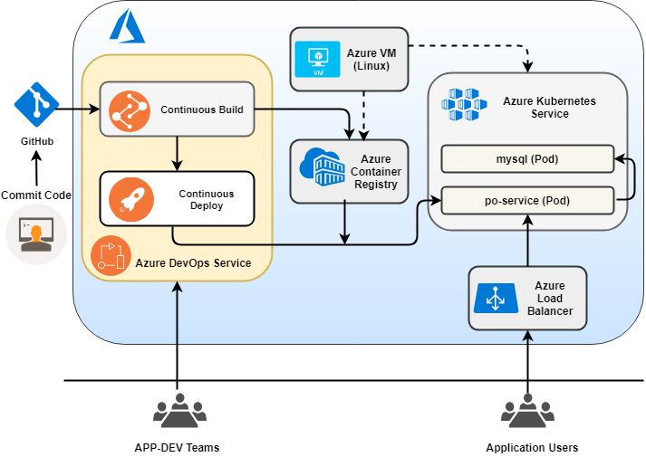

For easy and quick reference, readers can refer to the following on-line resources as needed.
- [Spring Getting Started Guides](https://spring.io/guides)
- [Docker Documentation](https://docs.docker.com/)
- [Kubernetes Documentation](https://kubernetes.io/docs/home/?path=users&persona=app-developer&level=foundational)
- [Creating an Azure VM](https://docs.microsoft.com/en-us/azure/virtual-machines/linux/quick-create-cli)
- [Azure Kubernetes Service (AKS) Documentation](https://docs.microsoft.com/en-us/azure/aks/)
- [Azure Container Registry (ACR) Documentation](https://docs.microsoft.com/en-us/azure/container-registry/)
- [Azure DevOps Services Documentation](https://docs.microsoft.com/en-us/azure/devops/?view=vsts)
- [Install Azure CLI 2.0](https://docs.microsoft.com/en-us/cli/azure/install-azure-cli?view=azure-cli-latest)

**Workflow:**

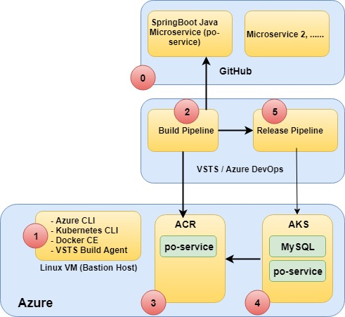

**Important Notes:**
- AKS is a managed [Kubernetes](https://kubernetes.io/) service on Azure.  Please refer to the [AKS](https://azure.microsoft.com/en-us/services/container-service/) product web page for more details.
- This project has been tested on both an unmanaged (Standalone) Kubernetes cluster v1.9.x and on AKS v1.9.1+.  Kubernetes artifacts such as manifest files for application *Deployments* may not work **as-is** on **AKS v1.8.x**.  Some of these objects are `Beta` level objects in Kubernetes v1.8.x and therefore version info. for the corresponding API objects will have to be changed in the manifest files prior to deployment to AKS.
- Commands which are required to be issued on a Linux terminal window are prefixed with a `$` sign.  Lines that are prefixed with the `#` symbol are to be treated as comments.
- This project requires **all** resources to be deployed to the same Azure **Resource Group**.
- Specify either **eastus**, **westus**, **westus2** or **centralus** as the *location* for the Azure *Resource Group* and the *AKS cluster*.

### A] Deploy a Linux CentOS VM on Azure (~ Bastion Host)
**Approx. time to complete this section: 45 minutes**

As a first step, we will deploy a Linux VM (CentOS) on Azure and install prerequisite CLI tools on it.  This VM will serve as a jump box (Bastion host) and allow us to manage PaaS services on Azure using CLI.

The following tools (binaries) will be installed on this VM.
- VSTS build agent (docker container). This build container will be used for running application and container builds.
- Azure CLI 2.0 client.  Azure CLI will be used to administer and manage all Azure resources including the AKS cluster resources.
- Git client.  We will be cloning this repository to make changes to the Kubernetes resources before deploying them to the AKS cluster.
- OpenJDK, Maven and Jenkins.  If you would like to learn how to build and deploy this SpringBoot microservice to AKS using Jenkins CI/CD, then you will also need to install Java run-time (OpenJDK), Maven and Jenkins.
- Kubernetes CLI (`kubectl`).  This binary will be used for managing resources on Kubernetes (AKS).
- Helm CLI (`helm`).  Helm is a package manager for Kubernetes and is used for automating the deployment of applications comprised of multiple microservices on Kubernetes.
- [Kubernetes Service Catalog](https://kubernetes.io/docs/concepts/extend-kubernetes/service-catalog/). Service Catalog will be used for dynamically provisioning PaaS services on Azure.

Follow the steps below to create the Bastion host (Linux VM), install pre-requisite software (CLI) on this VM, and run the VSTS build agent.

1.  Login to the [Azure Portal](https://portal.azure.com) using your credentials and use a **Azure Cloud Shell** session to perform the next steps.  Azure Cloud Shell is an interactive, browser-accessible shell for managing Azure resources.  The first time you access the Cloud Shell, you will be prompted to create a resource group, storage account and file share.  You can use the defaults or click on *Advanced Settings* to customize the defaults.  Accessing the Cloud Shell is described in [Overview of Azure Cloud Shell](https://docs.microsoft.com/en-us/azure/cloud-shell/overview). 

2.  An Azure resource group is a logical container into which Azure resources are deployed and managed.  From the Cloud Shell, use Azure CLI to create a **Resource Group**.  Azure CLI is already pre-installed and configured to use your Azure account (subscription) in the Cloud Shell.  Alternatively, you can also use Azure Portal to create this resource group.  
    ```bash
    # Create the resource group
    $ az group create --name myResourceGroup --location eastus
    ```
    **NOTE:** Keep in mind, if you specify a different name for the resource group (other than **myResourceGroup**), you will need to substitute the same value in multiple CLI commands in the remainder of this project!  If you are new to Azure or AKS, it's best to use the suggested name.

3.  Use the command below to create a **CentOS 7.4** VM on Azure.  Make sure you specify the correct **resource group** name and provide a value for the *password*.  Once the command completes, it will print the VM connection info. in the JSON message (response).  Note down the **Public IP address**, **Login name** and **Password** info. so that we can connect to this VM using SSH (secure shell).
Alternatively, if you prefer you can use SSH based authentication to connect to the Linux VM.  The steps for creating and using an SSH key pair for Linux VMs in Azure is documented [here](https://docs.microsoft.com/en-us/azure/virtual-machines/linux/mac-create-ssh-keys).  You can then specify the location of the public key with the `--ssh-key-path` option to the `az vm create ...` command.
    ```bash
    # Remember to specify the password for the 'labuser'.
    $ az vm create --resource-group myResourceGroup --name k8s-lab --image OpenLogic:CentOS:7.4:7.4.20180118 --size Standard_B2s --generate-ssh-keys --admin-username labuser --admin-password <password> --authentication-type password
    # When the above command exits, it will print the public IP address, login name (labuser) and password.  Make a note of these values.
    ```

4.  Login into the Linux VM via SSH.  On a Windows PC, you can use a SSH client such as [Putty](https://putty.org/) or the [Windows Sub-System for Linux (Windows 10)](https://docs.microsoft.com/en-us/windows/wsl/install-win10) to login into the VM.

    **NOTE:** Use of Cloud Shell to SSH into the VM is **NOT** recommended.
    ```bash
    # SSH into the VM.  Substitute the public IP address for the Linux VM in the command below.
    $ ssh labuser@x.x.x.x
    #
    ```

5.  Install Azure CLI, Kubernetes CLI, Helm CLI, Service Catalog CLI, Git client, Open JDK, Jenkins and Maven on this VM.  If you are a Linux power user and would like to save yourself some typing time, use this [shell script](./shell-scripts/setup-bastion.sh) to install all the pre-requisite CLI tools.
    ```bash
    # Install Azure CLI on this VM so that we can to deploy this application to the AKS cluster later in step [D].
    #
    # Import the Microsoft repository key.
    $ sudo rpm --import https://packages.microsoft.com/keys/microsoft.asc
    #
    # Create the local azure-cli repository information.
    $ sudo sh -c 'echo -e "[azure-cli]\nname=Azure CLI\nbaseurl=https://packages.microsoft.com/yumrepos/azure-cli\nenabled=1\ngpgcheck=1\ngpgkey=https://packages.microsoft.com/keys/microsoft.asc" > /etc/yum.repos.d/azure-cli.repo'
    #
    # Install with the yum install command.
    $ sudo yum install azure-cli
    #
    # Test the install
    $ az -v
    #
    # Login to your Azure account
    $ az login -u <user name> -p <password>
    #
    # View help on az commands, sub-commands
    $ az --help
    #
    # Install Git client
    $ sudo yum install git
    #
    # Check Git version number
    $ git --version
    #
    # Install OpenJDK 8 on the VM.
    $ sudo yum install -y java-1.8.0-openjdk-devel
    #
    # Check JDK version
    $ java -version
    #
    # Install Jenkins 2.138.1
    $ mkdir jenkins
    $ cd jenkins
    $ wget http://mirrors.jenkins.io/war-stable/latest/jenkins.war
    #
    # Switch back to home directory
    $ cd
    #
    # Install Maven 3.5.4
    $ mkdir maven
    $ cd maven
    $ wget http://www-eu.apache.org/dist/maven/maven-3/3.5.4/binaries/apache-maven-3.5.4-bin.tar.gz
    $ tar -xzvf apache-maven-3.5.4-bin.tar.gz
    #
    # Switch back to home directory
    $ cd
    #
    # Install Helm v2.11.0
    # Create a new directory 'Helm' under home directory to store the helm binary
    $ mkdir helm
    $ cd helm
    $ wget https://storage.googleapis.com/kubernetes-helm/helm-v2.11.0-linux-amd64.tar.gz
    $ tar -xzvf helm-v2.11.0-linux-amd64.tar.gz
    #
    # Switch back to home directory
    $ cd
    #
    # Install Kubernetes CLI
    # Create a new directory 'aztools' under home directory to store the kubectl binary
    $ mkdir aztools
    #
    # Install kubectl binary in the new directory
    $ az aks install-cli --install-location=./aztools/kubectl
    #
    # Install Service Catalog 'svcat' binary in 'aztools' directory
    $ cd aztools
    $ curl -sLO https://servicecatalogcli.blob.core.windows.net/cli/latest/$(uname -s)/$(uname -m)/svcat
    $ chmod +x ./svcat
    # Switch back to home directory
    $ cd
    #
    # Finally, update '.bashrc' file and set the path to Maven, Helm and Kubectl binaries
    $ KUBECLI=/home/labuser/aztools
    $ MAVEN=/home/labuser/maven/apache-maven-3.5.4/bin
    $ HELM=/home/labuser/helm/linux-amd64
    $ echo "export PATH=$MAVEN:$KUBECLI:$HELM:${PATH}" >> ~/.bashrc
    #
    ```

6.  Next, install **docker-ce** container runtime. Refer to the commands below.  You can also refer to the [Docker CE install docs for CentOS](https://docs.docker.com/install/linux/docker-ce/centos/).
    ```bash
    $ sudo yum update
    $ sudo yum install -y yum-utils device-mapper-persistent-data lvm2
    $ sudo yum-config-manager --add-repo https://download.docker.com/linux/centos/docker-ce.repo
    $ sudo yum install docker-ce-18.03.0.ce
    $ sudo systemctl enable docker
    $ sudo groupadd docker
    $ sudo usermod -aG docker labuser
    ```

    LOGOUT AND RESTART YOUR LINUX VM BEFORE PROCEEDING.  You can restart the VM via Azure Portal.  Once the VM is back up, log back in to the Linux VM via SSH.  Run the command below to verify **docker** engine is running.

    ```bash
    $ docker info
    ```

7.  Pull the Microsoft VSTS agent container from docker hub.  It will take approx. 20 to 30 minutes to download the image (~ 10+ GB).  Take a break and get some coffee!
    ```bash
    $ docker pull microsoft/vsts-agent
    $ docker images
    ```

8.  Next, we will generate a Azure DevOps Services personal access token (PAT) to connect our VSTS build agent to your Azure DevOps account.  Open a browser tab and login to Azure DevOps using your account ID. In the upper right, click on your profile image and click **Security**.  

    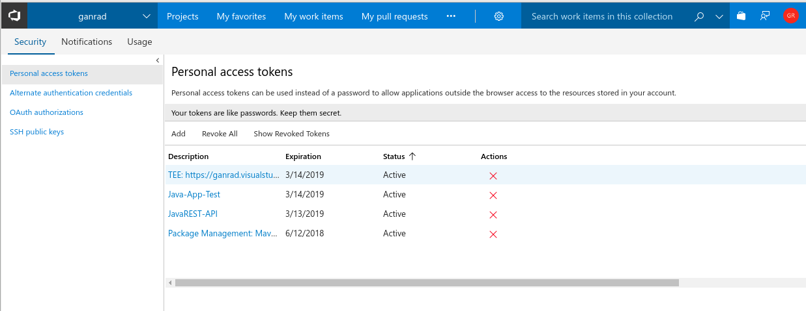

    Click on **+ New Token** to create a new PAT.  In the **Create a new personal access token** tab, provide a short **Name** for the token, select **Expiration**, select *Full access* for **Scopes** and click **Create**.  See screenshot below.

    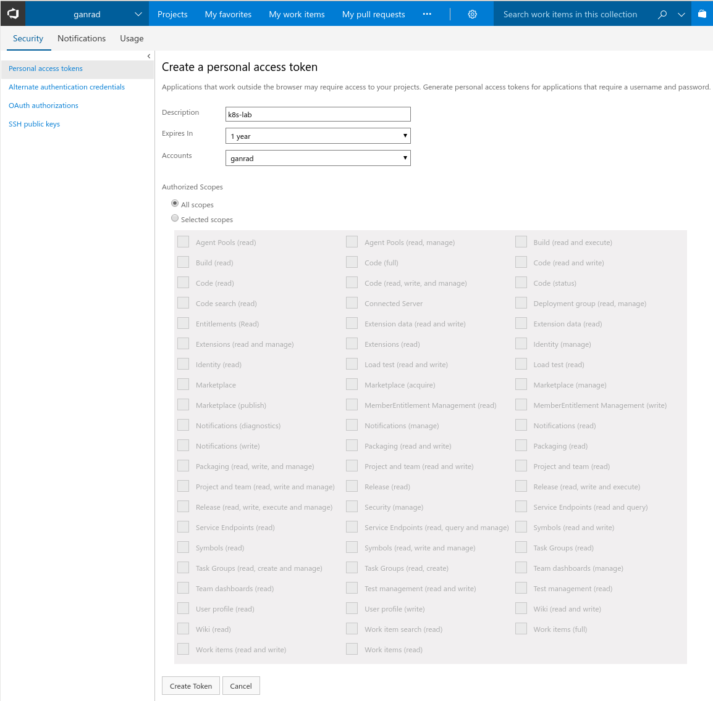

    In the next page, make sure to **copy and store** the PAT (token) into a file.  Keep in mind, you will not be able to retrieve this token again.  Incase you happen to lose or misplace the token, you will need to generate a new PAT and use it to reconfigure the VSTS build agent.  Save this PAT (token) to a file.

9.  In the Linux VM terminal window, use the command below to start the VSTS build container.  Refer to the table below to set the build container parameter values correctly.

    Parameter | Value
    --------- | -----
    VSTS_TOKEN | VSTS PAT Token.  This is the value which you copied and saved in a file in the previous step.
    VSTS_ACCOUNT | VSTS Organization name.  An Org. is a container for DevOps projects in Azure DevOps (VSTS) platform.  It's usually the first part (Prefix) of the VSTS URL (eg., **Prefix**.visualstudio.com).  If you are using Azure DevOps URL, then it is the last part (ContextPath) of the URL (eg., dev.azure.com/**ContextPath**).

    ```bash
    $ docker run -e VSTS_ACCOUNT=<Org. Name> -e VSTS_TOKEN=<PAT Token> -v /var/run/docker.sock:/var/run/docker.sock --name vstsagent -it microsoft/vsts-agent
    ```
    The VSTS build agent will initialize and you should see a message indicating "Listening for Jobs".  See below.  
    ```
    Determining matching VSTS agent...
    Downloading and installing VSTS agent...

    >> End User License Agreements:

    Building sources from a TFVC repository requires accepting the Team Explorer Everywhere End User License Agreement. This step is not required for building sources from Git repositories.

    A copy of the Team Explorer Everywhere license agreement can be found at:
      /vsts/agent/externals/tee/license.html


    >> Connect:

    Connecting to server ...

    >> Register Agent:

    Scanning for tool capabilities.
    Connecting to the server.
    Successfully added the agent
    Testing agent connection.
    2018-09-17 16:59:56Z: Settings Saved.
    Scanning for tool capabilities.
    Connecting to the server.
    2018-09-17 16:59:59Z: Listening for Jobs
    ```
    Minimize this terminal window for now as you will only be using it to view the results of a VSTS build.  Before proceeding, open another terminal (WSL Ubuntu/Putty) window and login (SSH) into the Linux VM.

### B] Deploy Azure Container Registry (ACR)
**Approx. time to complete this section: 10 minutes**

In this step, we will deploy an instance of Azure Container Registry to store container images which we will build in later steps.  A container registry such as ACR allows us to store multiple versions of application container images in one centralized repository and consume them from multiple nodes (VMs/Servers) where our applications are deployed.

1.  Login to your Azure portal account.  Then click on **Container registries** in the navigational panel on the left.  If you don't see this option in the nav. panel then click on **All services**, scroll down to the **COMPUTE** section and click on the star beside **Container registries**.  This will add the **Container registries** option to the service list in the navigational panel.  Now click on the **Container registries** option.  You will see a page as displayed below.

    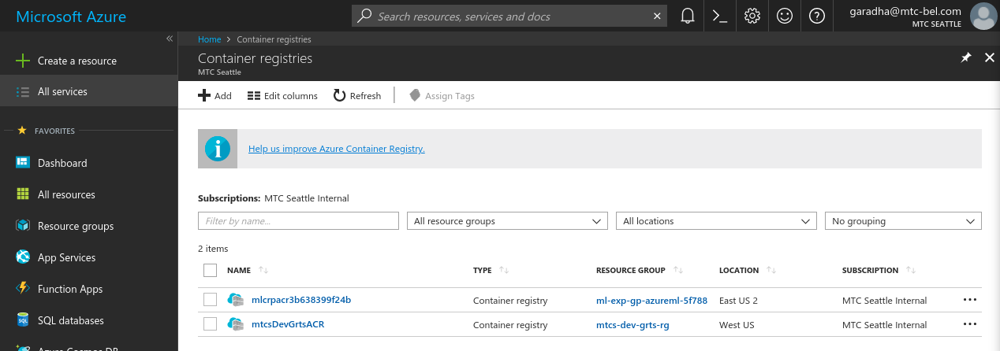

2.  Click on **Add** to create a new ACR instance.  Give a meaningful name to your registry and make a note of it.  Select an Azure **Subscription**, select the **Resource group** which you created in Section [A] and leave the **Location** field as-is.  The location should default to the location assigned to the resource group.  Select the **Basic** pricing tier.  Click **Create** when you are done.

    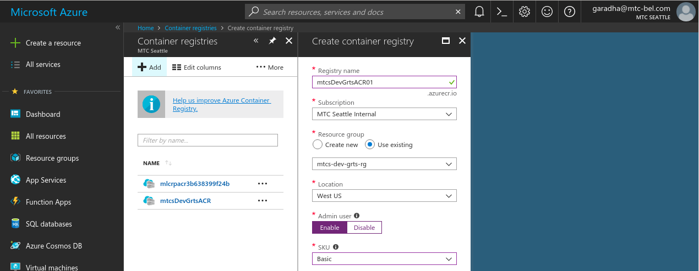


### C] Create a *Build Pipeline* in Azure DevOps to deploy the Springboot microservice
**Approx. time to complete this section: 1 Hour**

In this step, we will define the tasks for building the microservice (binary artifacts) application and packaging (layering) it within a docker container.  The build tasks use **Maven** to build the Springboot microservice & **docker-compose** to build the application container.  During the application container build process, the application binary is layered on top of a base docker image (CentOS 7).  Finally, the built application container is pushed into ACR which we deployed in step [B] above.

Before proceeding with the next steps, feel free to inspect the dockerfile and source files in the GitHub repository (under src/...).  This will give you a better understanding of how continuous integration (CI) can be easily implemented using Azure DevOps.

1.  Fork this [GitHub repository](https://github.com/ganrad/k8s-springboot-data-rest) to **your** GitHub account.  In the browser window, click on **Fork** in the upper right hand corner to get a separate copy of this project added to your GitHub account.  You must be signed in to your GitHub account in order to fork this repository.

    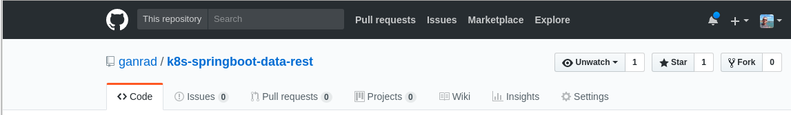

    From the terminal window connected to the Bastion host (Linux VM), clone this repository.  Ensure that you are using the URL of your fork when cloning this repository.
    ```bash
    # Switch to home directory
    $ cd
    # Clone your GitHub repository.  This will allow you to make changes to the application artifacts without affecting resources in the forked (original) GitHub project.
    $ git clone https://github.com/<YOUR-GITHUB-ACCOUNT>/k8s-springboot-data-rest.git
    #
    # Switch to the 'k8s-springboot-data-rest' directory
    $ cd k8s-springboot-data-rest
    ```

2.  Create an Azure Service Principal (SP) and assign *Contributor* role access to the ACR created in Section [B].  This SP will be used in a subsequent lab (Jenkins-CI-CD) to push the *po-service* container image into ACR and re-deploy the microservice to AKS.
    Execute the shell script `./shell-scripts/jenkins-acr-auth.sh` in the Linux VM (Bastion Host) terminal window.  The command output will be displayed on the console and also saved to a file (SP_ACR.txt) in the current directory.  Before running the shell script, open it in 'vi' editor (or 'nano') and specify the correct values for variables 'ACR_RESOURCE_GROUP' and 'ACR_NAME'. 
    ```bash
    # Enable execute permission for this script
    $ chmod 700 ./shell-scripts/jenkins-acr-auth.sh
    #
    # Specify the correct values for `ACR_RESOURCE_GROUP` and `ACR_NAME` in this shell script before running it
    $ ./shell-scripts/jenkins-acr-auth.sh 
    # Make sure the 'SP_ACR.txt' file got created in the current working directory
    $ cat SP_ACR.txt
    ```

3.  If you haven't already done so, login to [Azure DevOps Services](https://aka.ms/azdev-signin) using your Microsoft Live ID (or Azure AD ID) and create an *Organization*.  Give the Organization a meaningful name (eg., Your initials-AzureLab) and then create a new DevOps project. Give a name to your project.

    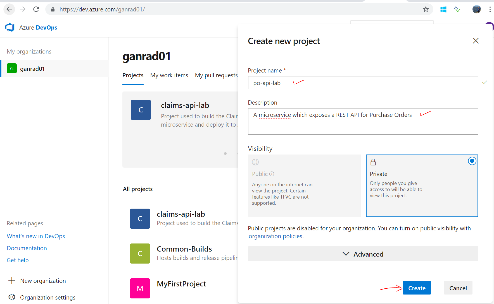

4.  We will now create a **Build** definition and define tasks which will execute as part of the application build process.  Click on **Pipelines** in the left navigational menu and then select *Builds*.  Click on **New pipeline**.

    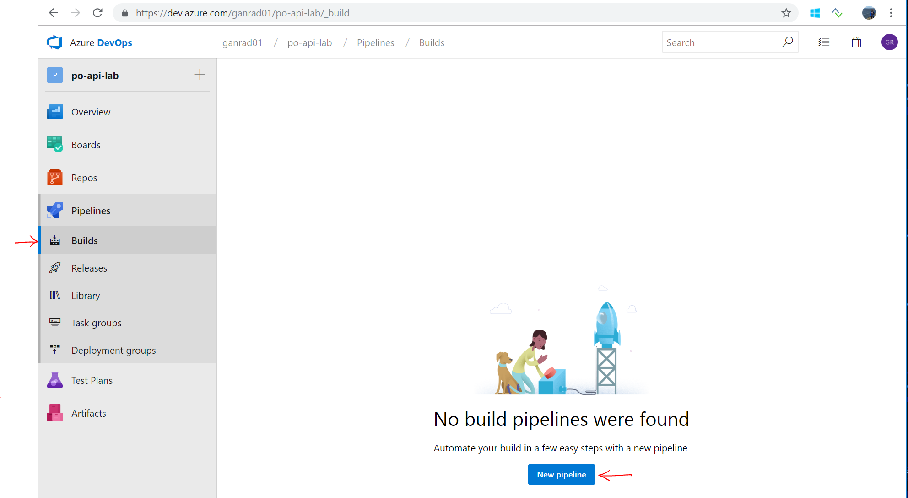

5.  In the **Select a source** page, select *GitHub* as the source repository. Give your connection a *name* and then select *Authorize using OAuth* link.  Optionally, you can use a GitHub *personal access token* instead of OAuth.  When prompted, sign in to your **GitHub account**.  Then select *Authorize* to grant access to your Azure DevOps account.

    Once authorized, select the **GitHub Repo** which you forked in step [1] above.  Make sure you replace the account name in the **GitHub URL** with your account name.  Then hit continue.

    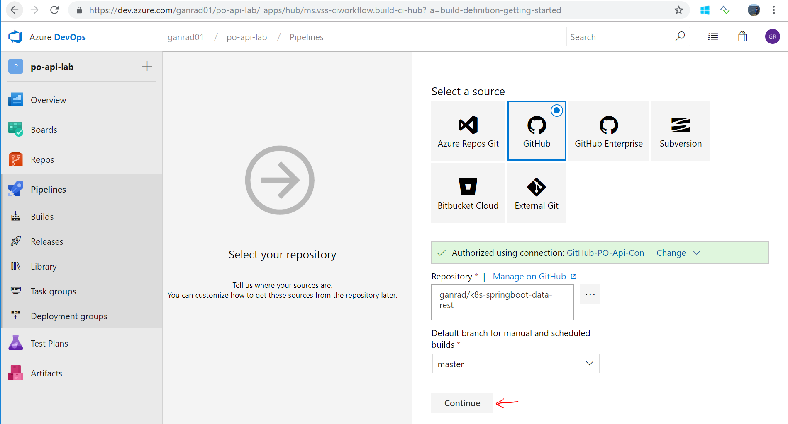

6.  Search for text *Maven* in the **Select a template** field and then select *Maven* build.  Then click apply.

    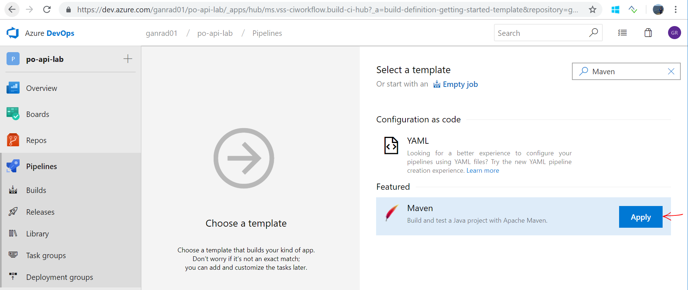

7.  Select *Default* in the **Agent Queue** field.  The VSTS build agent which you deployed in step [A] connects to this *queue* and listens for build requests.

    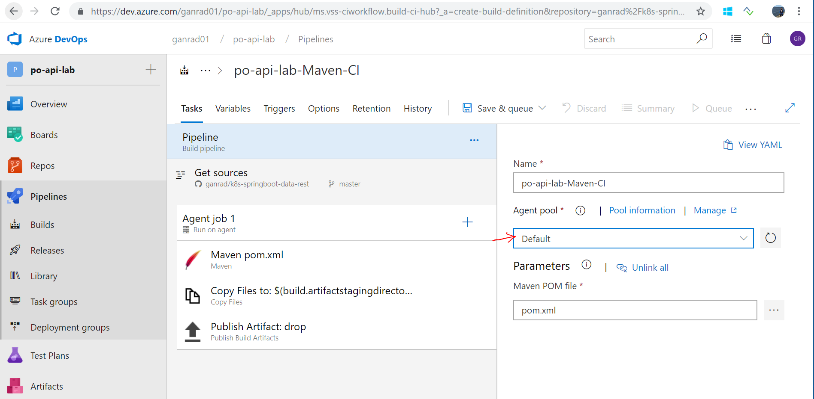

    **Save** the build pipeline before proceeding.

8.  On the top extensions menu in Azure DevOps, click on **Browse Markplace** (Bag icon).  Then search for text **replace tokens**.  In the results list below, click on **Colin's ALM Corner Build and Release Tools** (circled in yellow in the screenshot).  Then click on **Get it free** to install this extension in your Azure DevOps account.

    

    Next, search for text **Release Management Utility Tasks** extension provided by Microsoft DevLabs.  This extension includes the **Tokenizer utility** which we will be using in a continuous deployment (CD) step later on in this project.  Click on **Get it free** to install this extension in your Azure DevOps account.  See screenshot below.

    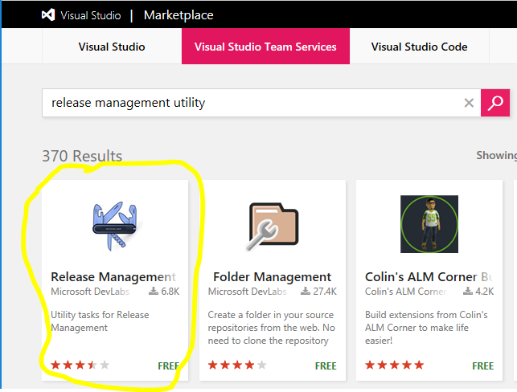

    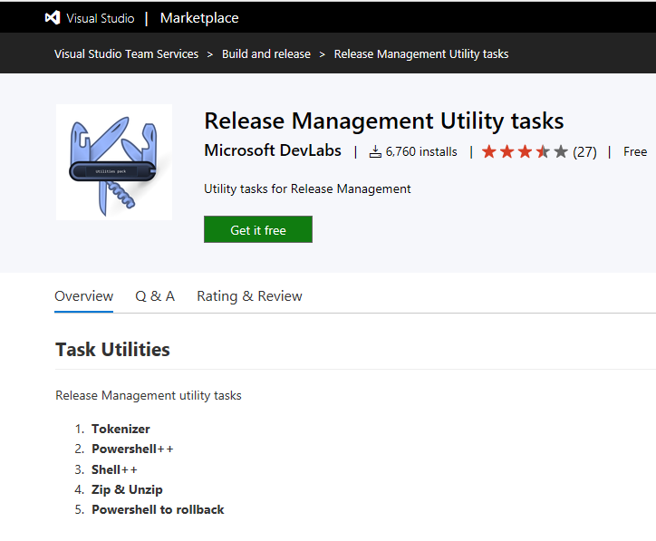

9.  Go back to your build definition and click on the plus symbol beside **Agent job 1**.  Search by text **replace tokens** and then select the extension **Replace Tokens** which you just installed in the previous step.  Click **Add**.

    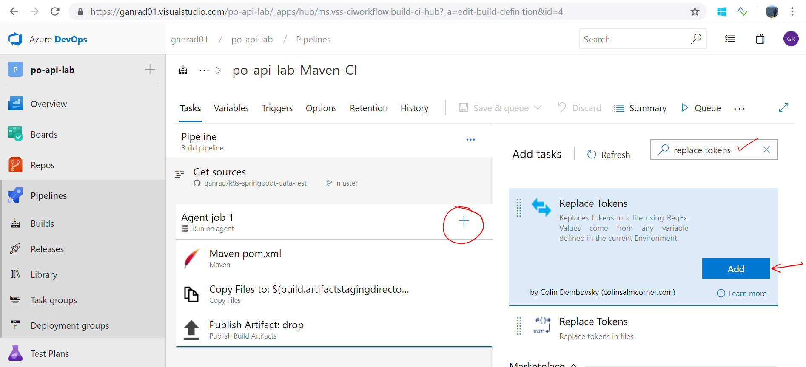

10.  Click on the **Replace Tokens** task and drag it to the top of the task list.  In the **Display name** field, specify *Replace MySql service name and k8s namespace in Springboot config file*.  In the **Source Path** field, select *src/main/resources* and specify `*.properties` in the **Target File Pattern** field.  Click on **Advanced** and in the **Token Regex** field, specify `__(\w+[.\w+]*)__` as shown in the screenshot below.  In the next step, we will use this task to specify the target service name and Kubernetes namespace name for MySQL.

     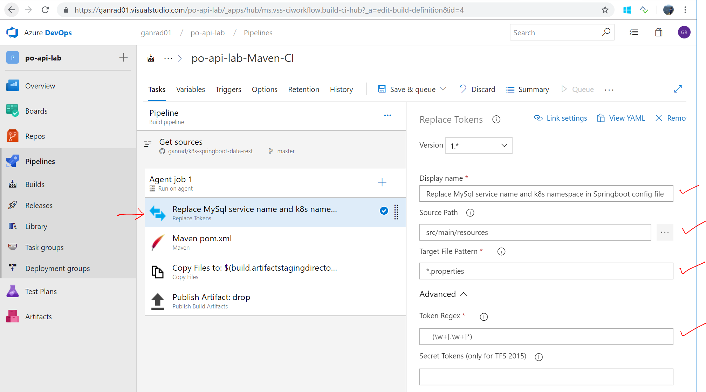

11.  Click on the **Variables** tab and add a new variable to specify the Kubernetes MySQL service name and namespace name as shown in the screenshot below.  When the build pipeline runs, it replaces the value of the variable *svc.name.k8s.namespace* with **mysql.development** in file *src/main/resources/application.properties*.  This allows us to modify the connection settings for MySQL service in the PO microservice application without having to change any line of code.  As such, the MySQL service could be deployed in any Kubernetes namespace and we can easily connect to that instance by setting this variable at build time.

     Variable Name | Value
     ------------- | ------
     svc.name.k8s.namespace | mysql.development

     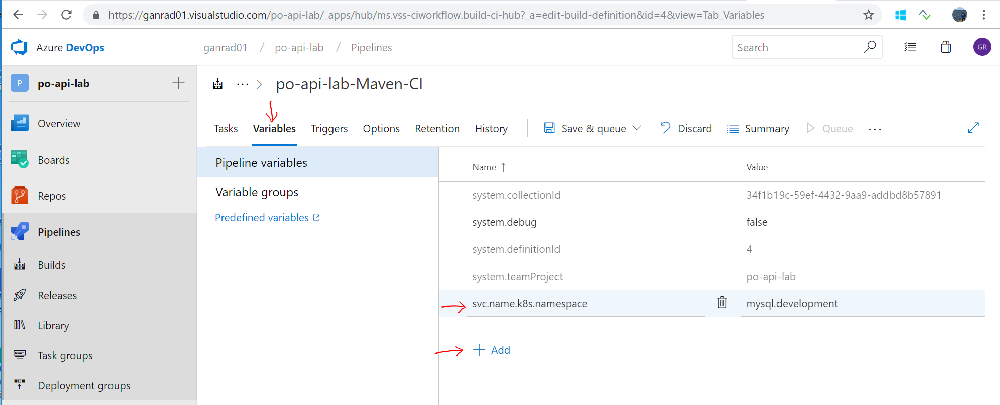

12.  Switch back to the **Tasks** tab and click on the **Maven** task.  Specify values for fields **Goal(s)**, **Options** as shown in the screen shot below.  Ensure **Publish to TFS/Team Services** checkbox is enabled.

     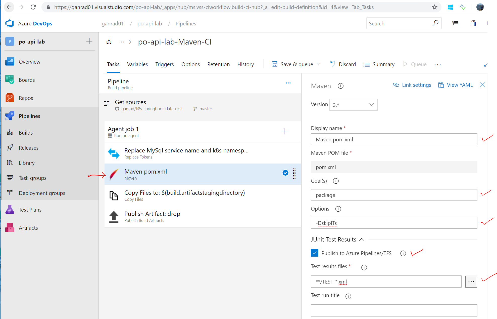

13.  Go thru the **Copy Files...** and **Publish Artifact:...** tasks.  These tasks copy the application binary artifacts (*.jar) to the **drop** location on the Azure DevOps server.  In **Copy Files...** task, you will need to add `**/*.yaml` to the **Contents** field. See screenshot below.
   
     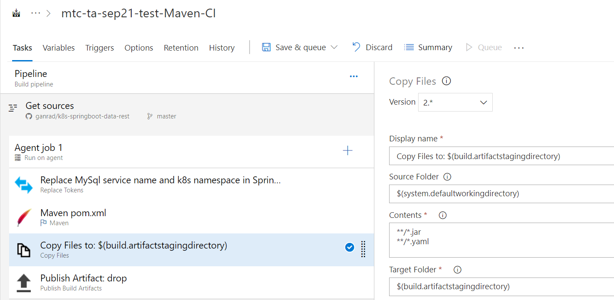

14.  Next, we will package our application binary within a container image.  Review the **docker-compose.yml** and **Dockerfile** files in the source repository to understand how the application container image is built.  Click on the plus symbol besides *Agent job 1* to add a new task. Search for task *Docker Compose* and click **Add**.

     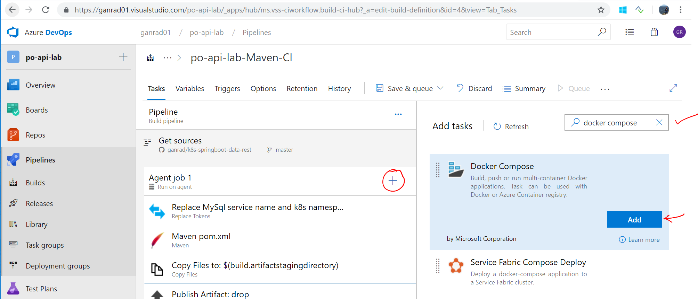

15.  Click on the *Docker Compose ...* task on the left panel.  Specify *Build container image* for **Display name** field and *Azure Container Registry* for **Container Registry Type**.  In the **Azure Subscription** field, select your Azure subscription.  Click on **Authorize**.  In the **Azure Container Registry** field, select the ACR which you created in step [B] above.  Check to make sure the **Docker Compose File** field is set to `**/docker-compose.yml`.  Enable **Qualify Image Names** checkbox.  In the **Action** field, select *Build service images* and specify *$(Build.BuildNumber)* for field **Additional Image Tags**.  Also enable **Include Latest Tag** checkbox.  See screenshot below.

     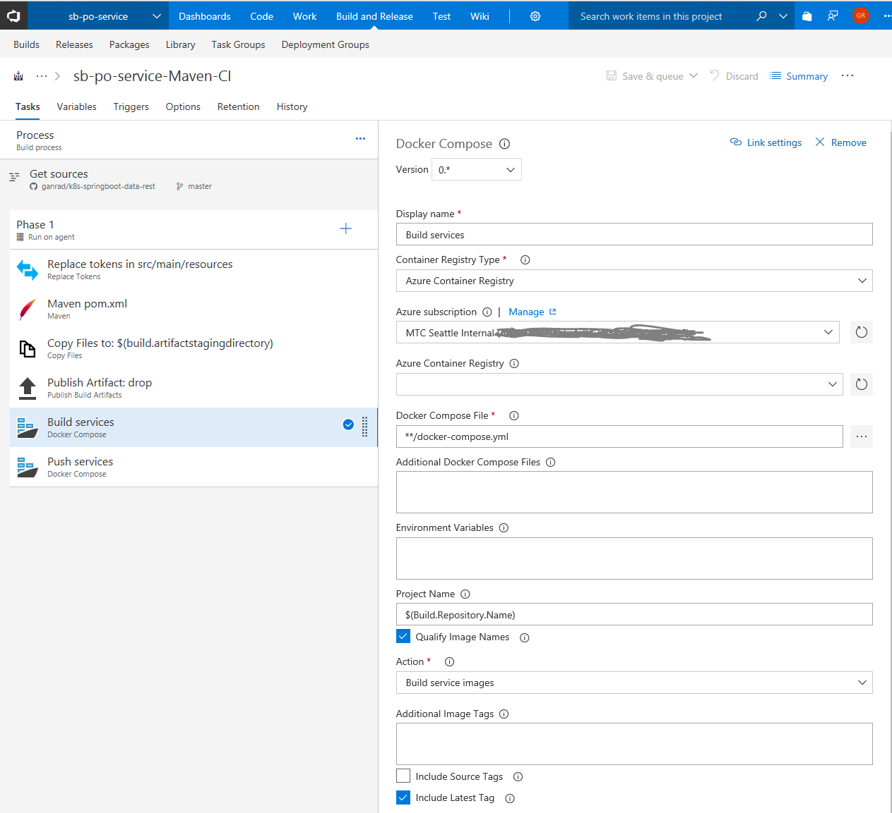

16.  Once our application container image has been built, we will push it into the ACR.  Let's add another task to publish the container image built in the previous step to ACR.  Similar to step [15], search for task *Docker Compose* and click **Add**.

     Click on the *Docker Compose ...* task on the left.  Specify *Push container image to ACR* for field **Display name** and *Azure Container Registry* for **Container Registry Type**.  In the **Azure Subscription** field, select your Azure subscription (Under Available Azure service connections).  In the **Azure Container Registry** field, select the ACR which you created in step [B] above.  Check to make sure the **Docker Compose File** field is set to `**/docker-compose.yml`.  Enable **Qualify Image Names** checkbox.  In the **Action** field, select *Push service images* and specify *$(Build.BuildNumber)* for field **Additional Image Tags**.  Also enable **Include Latest Tag** checkbox.  See screenshot below.

     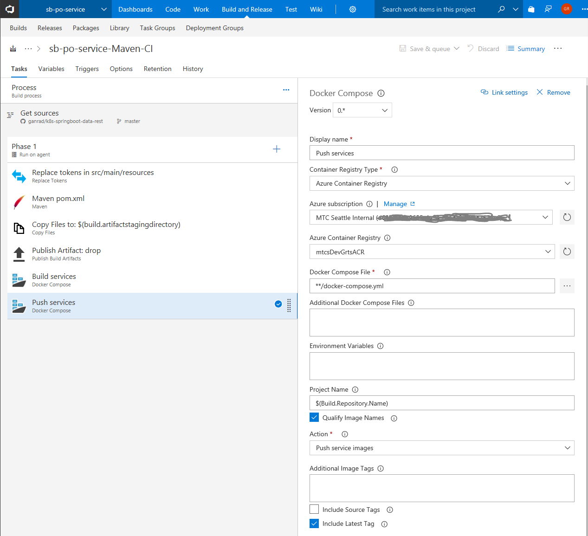

17.  Click **Save and Queue** to save the build definition and queue it for execution. Click on the Build number on the top of the page to view the progess of the build.  Wait for the build process to finish.  When all build tasks complete OK and the build process finishes, you will see the screen below.

     

     Switch to the VSTS build agent terminal window and you will notice that a build request was received from Azure DevOps and processed successfully. See below.

     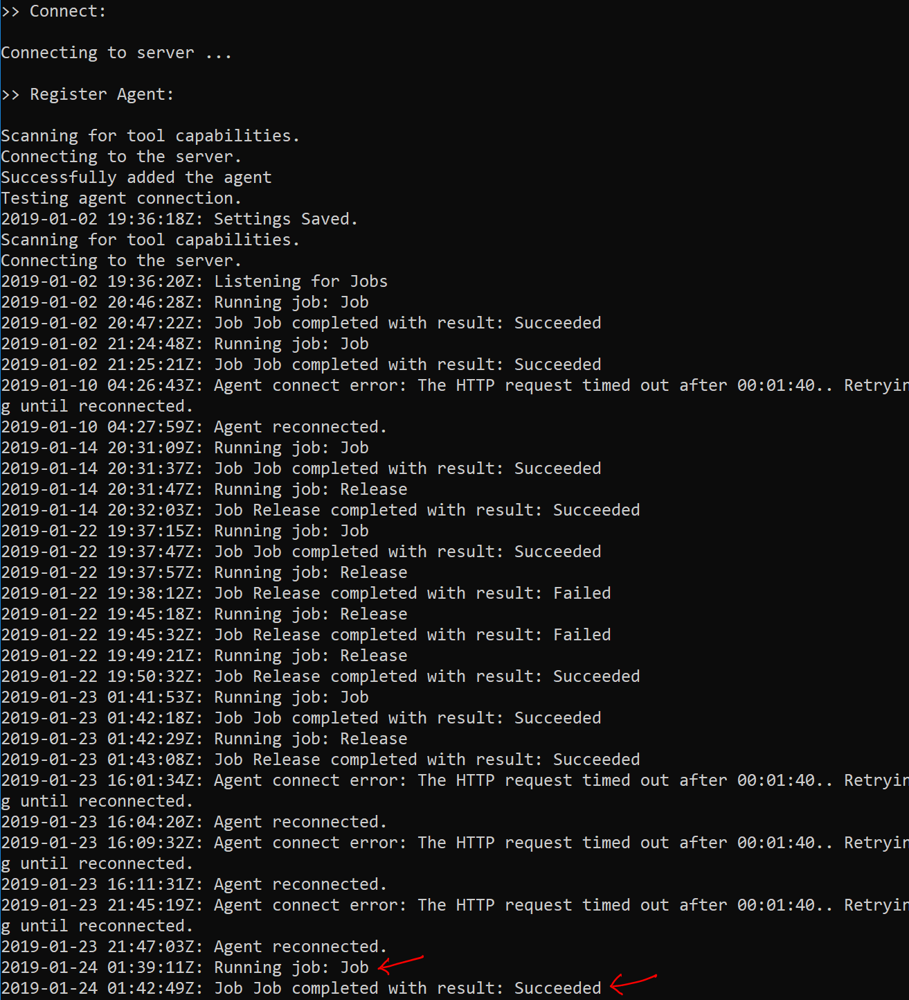

     Login to the Azure portal, open the blade for *Azure Container Registry* and verify that the container image for **po-service** API microservice has been pushed into the registry.

     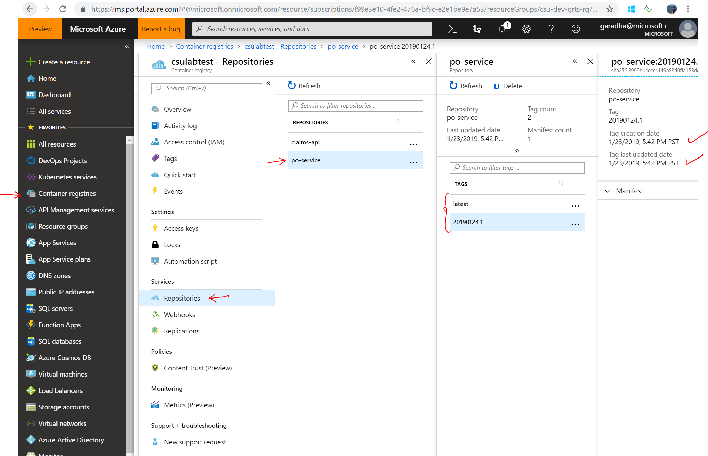

### D] Create an Azure Kubernetes Service (AKS) cluster and deploy Springboot microservice
**Approx. time to complete this section: 1 - 1.5 Hours**

In this step, we will first deploy an AKS cluster on Azure.  The Springboot **Purchase Order** microservice application reads/writes purchase order data from/to a relational (MySQL) database.  So we will deploy a **MySQL** database container (ephemeral) first and then deploy our Springboot Java application.  Kubernetes resources (object definitions) are usually specified in manifest files (yaml/json) and then submitted to the API Server.  The API server is responsible for instantiating corresponding objects and bringing the state of the system to the desired state.

Kubernetes manifest files for deploying the **MySQL** and **po-service** (Springboot application) containers are provided in the **k8s-scripts/** folder in this GitHub repository.  There are two manifest files in this folder **mysql-deploy.yaml** and **app-deploy.yaml**.  As the names suggest, the *mysql-deploy* manifest file is used to deploy the **MySQL** database container and the other file is used to deploy the **Springboot** microservice respectively.

Before proceeding with the next steps, feel free to inspect the Kubernetes manifest files to get a better understanding of the following.  These are all out-of-box features provided by Kubernetes.
-  How confidential data such as database user names & passwords are injected (at runtime) into the application container using **Secrets**
-  How application configuration information (non-confidential) such as database connection URL and the database name parameters are injected (at runtime) into the application container using **ConfigMaps**
-  How **environment variables** such as the MySQL listening port is injected (at runtime) into the application container.
-  How services in Kubernetes can auto discover themselves using the built-in **Kube-DNS** proxy.

In case you want to modify the default values used for MySQL database name and/or database connection properties (user name, password ...), refer to [Appendix A](#appendix-a) for details.  You will need to update the Kubernetes manifest files.

Follow the steps below to provision the AKS cluster and deploy the *po-service* microservice.
1.  Ensure the *Resource provider* for AKS service is enabled (registered) for your subscription.  A quick and easy way to verify this is, use the Azure portal and go to *->Azure Portal->Subscriptions->Your Subscription->Resource providers->Microsoft.ContainerService->(Ensure registered)*.  Alternatively, you can use Azure CLI to register all required service providers.  See below.
    ```bash
    $ az provider register -n Microsoft.Network
    $ az provider register -n Microsoft.Storage
    $ az provider register -n Microsoft.Compute
    $ az provider register -n Microsoft.ContainerService
    ```

2.  At this point, you can use a) The Azure Portal Web UI to create an AKS cluster and b) The Kubernetes Dashboard UI to deploy the Springboot Microservice application artifacts.  To use a web browser (*Web UI*) for deploying the AKS cluster and application artifacts, refer to the steps in [extensions/k8s-dash-deploy](./extensions/k8s-dash-deploy).

    **NOTE**: If you are new to Kubernetes and not comfortable with issuing commands on a Linux terminal window, use the Azure Portal and the Kubernetes dashboard UI (link above).

    Alternatively, if you prefer CLI for deploying and managing resources on Azure and Kubernetes, continue with the next steps.

    (If you haven't already) Open a terminal window and login to the Linux VM (Bastion host).
    ```bash
    #
    # Check if kubectl is installed OK
    $ kubectl version -o yaml
    ```

3.  Refer to the commands below to create an AKS cluster.  If you haven't already created a **resource group**, you will need to create one first.  If needed, go back to step [A] and review the steps for the same.  Cluster creation will take a few minutes to complete.
    ```bash
    # Create a 1 Node AKS cluster
    $ az aks create --resource-group myResourceGroup --name akscluster --node-count 1 --dns-name-prefix akslab --generate-ssh-keys --disable-rbac  --kubernetes-version "1.11.5"
    #
    # Verify state of AKS cluster
    $ az aks show -g myResourceGroup -n akscluster --output table
    ```

4.  Connect to the AKS cluster and initialize **Helm** package manager.
    ```bash
    # Configure kubectl to connect to the AKS cluster
    $ az aks get-credentials --resource-group myResourceGroup --name akscluster
    #
    # Check cluster nodes
    $ kubectl get nodes -o wide
    #
    # Check default namespaces in the cluster
    $ kubectl get namespaces
    #
    # Initialize Helm.  This will install 'Tiller' on AKS.  Wait for this command to complete!
    $ helm init
    #
    # Check if Helm client is able to connect to Tiller on AKS.
    # This command should list both client and server versions.
    $ helm version
    Client: &version.Version{SemVer:"v2.11.0", GitCommit:"20adb27c7c5868466912eebdf6664e7390ebe710", GitTreeState:"clean"}
    Server: &version.Version{SemVer:"v2.11.0", GitCommit:"2e55dbe1fdb5fdb96b75ff144a339489417b146b", GitTreeState:"clean"}
    ```

5.  Next, create a new Kubernetes **namespace** resource.  This namespace will be called *development*.  
    ```bash
    # Make sure you are in the *k8s-springboot-data-rest* directory.
    $ kubectl create -f k8s-scripts/dev-namespace.json 
    #
    # List the namespaces
    $ kubectl get namespaces
    ```

6.  Create a new Kubernetes context and associate it with the **development** namespace.  We will be deploying all our application artifacts into this namespace in subsequent steps.
    ```bash
    # Create the 'dev' context
    $ kubectl config set-context dev --cluster=akscluster --user=clusterUser_myResourceGroup_akscluster --namespace=development
    #
    # Switch the current context to 'dev'
    $ kubectl config use-context dev
    #
    # Check your current context (should list 'dev' in the output)
    $ kubectl config current-context
    ```

7.  Configure Kubernetes to pull application container images from ACR (configured in step [B]).  When AKS cluster is created, Azure also creates a 'Service Principal' (SP) to support cluster operability with other Azure resources.  This auto-generated service principal can be used to authenticate against the ACR.  To do so, we need to create an Azure AD role assignment that grants the cluster's SP access to the Azure Container Registry.  In a Linux terminal window, update the shell script `shell-scripts/acr-auth.sh` with correct values for the following variables.

    Variable | Description
    ----------------- | -------------------
    AKS_RESOURCE_GROUP | Name of the AKS resource group
    AKS_CLUSTER_NAME | Name of the AKS cluster instance
    ACR_RESOURCE_GROUP | Name of the ACR resource group
    ACR_NAME | Name of ACR instance

    Then execute this shell script.  See below.

    ```bash
    # Change file permission to allow user to execute the script
    $ chmod 700 ./shell-scripts/acr-auth.sh
    #
    # Update the shell script and then run it
    $ ./shell-scripts/acr-auth.sh
    #
    ```

    At this point you will also want to save your Kube Configuation file to a known temporary location.  You will need this to properly setup your Kubernetes cluster in a subsequent lab.  To do this, in your Terminal, `cat` the kube config file and cut and paste it's contents into another file. Save this config file to a directory location on you local workstation/PC.
    ```bash
    $ cat ~/.kube/config
    ```

    It should appear similar to this

    ```YAML
    apiVersion: v1
    clusters:
    - cluster:
      certificate-authority-data: LS0tLS1CRUdJTiBDRVJU---------UZJQ0FURS0tLS0tCg==
      server: https://YOURREGISTRY.hcp.centralus.azmk8s.io:443
    name: akscluster
    contexts:
    - context:
      cluster: akscluster
      namespace: development
      user: clusterUser_atsAKS2_akscluster
    name: akscluster
    - context:
      cluster: akscluster
      namespace: development
      user: clusterUser_myResourceGroup_akscluster
    name: dev
    current-context: akscluster
    kind: Config
    preferences: {}
    users:
    - name: clusterUser_atsAKS2_akscluster
      user:
        client-certificate-data: LS0tLS1CRUdJT---------lGSUNBVEUtLS0tLQo=
        client-key-data: LS0tLS1CRUdJTiBSU0EgUFJJV-------------UgS0VZLS0tLS0K
        token: 3----------------a
    ```

8.  Update the **k8s-scripts/app-deploy.yaml** file.  The *image* attribute should point to your ACR which you provisioned in Section [B].  This will ensure AKS pulls the application container image from the correct registry. Substitute the correct value for the *ACR registry name* in the *image* attribute (highlighted in yellow) in the pod spec as shown in the screenshot below.

    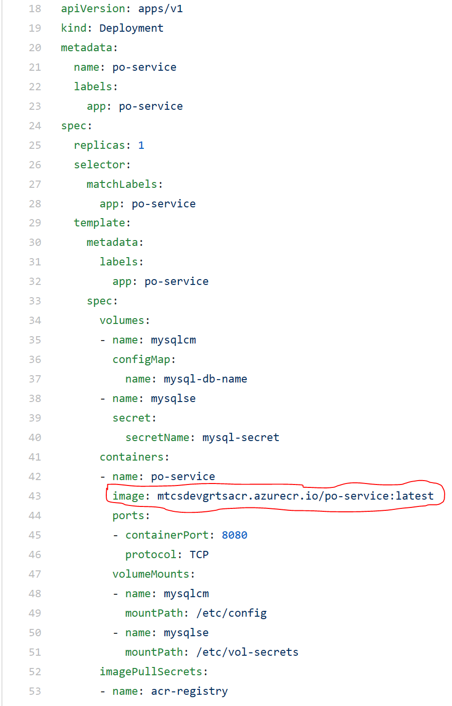

9.  Deploy the **MySQL** database container.
    ```bash
    # Make sure you are in the *k8s-springboot-data-rest* directory.
    $ kubectl create -f k8s-scripts/mysql-deploy.yaml
    #
    # List pods.  You can specify the '-w' switch to watch the status of pod change.
    $ kubectl get pods
    ```
    The status of the mysql pod should change to *Running*.  See screenshot below.

    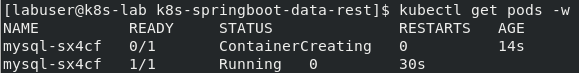

    (Optional) You can login to the mysql container using the command below. Specify the correct value for the pod ID (Value under 'Name' column listed in the previous command output).  The password for the 'mysql' user is 'password'.
    ```bash
    $ kubectl exec <pod ID> -i -t -- mysql -u mysql -p sampledb
    ```

10.  Deploy the **po-service** microservice container.
     ```bash
     # Make sure you are in the *k8s-springboot-data-rest* directory.
     $ kubectl create -f k8s-scripts/app-deploy.yaml
     #
     # List pods.  You can specify the '-w' switch to watch the status of pod change.
     $ kubectl get pods
     ```
     The status of the po-service pod should change to *Running*.  See screenshot below.

     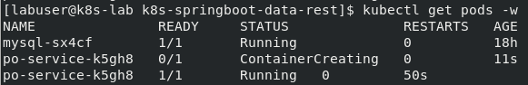

11.  (Optional) As part of deploying the *po-service* Kubernetes service object, an Azure cloud load balancer gets auto-provisioned and configured. The load balancer accepts HTTP requests for our microservice and re-directes all calls to the service endpoint (port 8080).  Take a look at the Azure load balancer.

     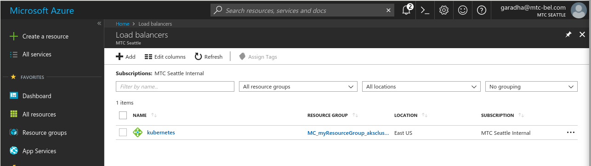

### Accessing the Purchase Order Microservice REST API 

As soon as the **po-service** application is deployed in AKS, 2 purchase orders will be inserted into the backend (MySQL) database.  The inserted purchase orders have ID's 1 and 2.  The application's REST API supports all CRUD operations (list, search, create, update and delete) on purchase orders.

In a Kubernetes cluster, applications deployed within pods communicate with each other via services.  A service is responsible for forwarding all incoming requests to the backend application pods.  A service can also expose an *External IP Address* so that applications thatare external to the AKS cluster can access services deployed within the cluster.

Use the command below to determine the *External* (public) IP address (Azure load balancer IP) assigned to the service end-point.
```
# List the kubernetes service objects
$ kubectl get svc
```
The above command will list the **IP Address** (both internal and external) for all services deployed within the *development* namespace as shown below.  Note how the **mysql** service doesn't have an *External IP* assigned to it.  Reason for that is, we don't want the *MySQL* service to be accessible from outside the AKS cluster.

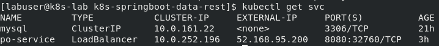

The REST API exposed by this microservice can be accessed by using the _context-path_ (or Base Path) `orders/`.  The REST API endpoint's exposed are as follows.

URI Template | HTTP VERB | DESCRIPTION
------------ | --------- | -----------
orders/ | GET | To list all available purchase orders in the backend database.
orders/{id} | GET | To get order details by `order id`.
orders/search/getByItem?{item=value} | GET | To search for a specific order by item name
orders/ | POST | To create a new purchase order.  The API consumes and produces orders in `JSON` format.
orders/{id} | PUT | To update a new purchase order. The API consumes and produces orders in `JSON` format.
orders/{id} | DELETE | To delete a purchase order.

You can access the Purchase Order REST API from your Web browser, e.g.:

- http://<Azure_load_balancer_ip>/orders
- http://<Azure_load_balancer_ip>/orders/1

Use the sample scripts in the **./test-scripts** folder to test this microservice.

Congrats!  You have just built and deployed a Java Springboot microservice on Azure Kubernetes Service!!

We will define a **Release Pipeline** in Azure DevOps to perform automated application deployments to AKS next.

### E] Create a *Release Pipeline* in Azure DevOps to re-deploy the Springboot microservice
**Approx. time to complete this section: 1 Hour**

1.  Using a web browser, login to your Azure DevOps account (if you haven't already) and select your project which you created in Step [C]. Click on *Pipelines* menu in the left navigational panel and select *Releases*.  Next, click on *New pipeline*.

    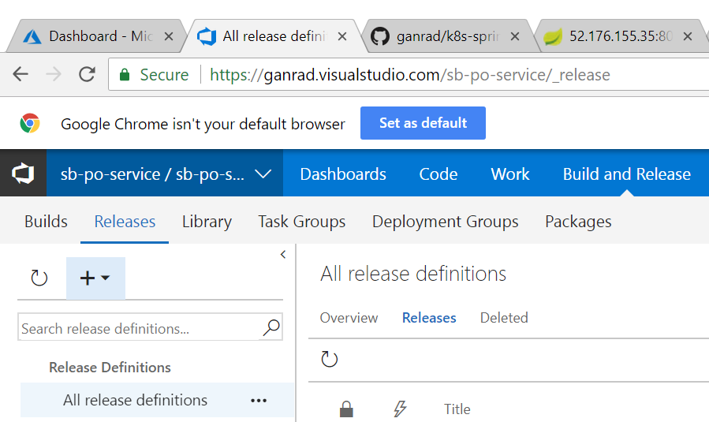

    In the *Select a Template* page, click on *Empty job*.  See screenshot below.

    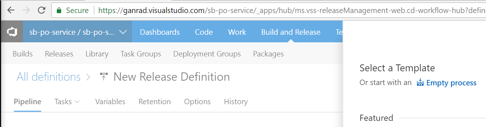

    In the *Stage* page, specify *Staging-A* as the name for the environment.  Then click on *+Add* besides *Artifacts* (under *Pipeline* tab).

    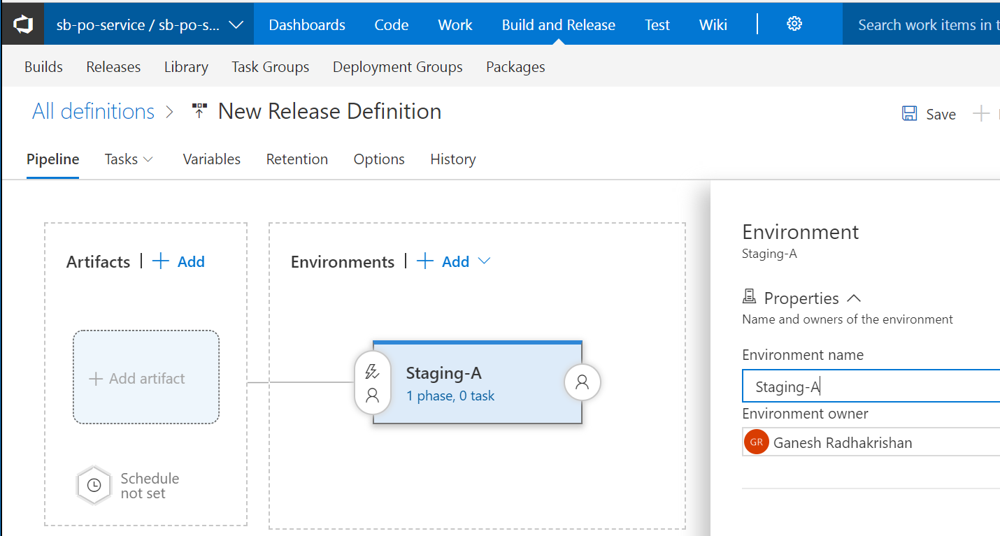

    In the *Add artifact* page, select *Build* for **Source type**, select your Azure DevOps project from the **Project** drop down menu and select your *Build definition* in the drop down menu for **Source (build pipeline)**.  Select *Latest* for field **Default version**. See screenshot below. 

    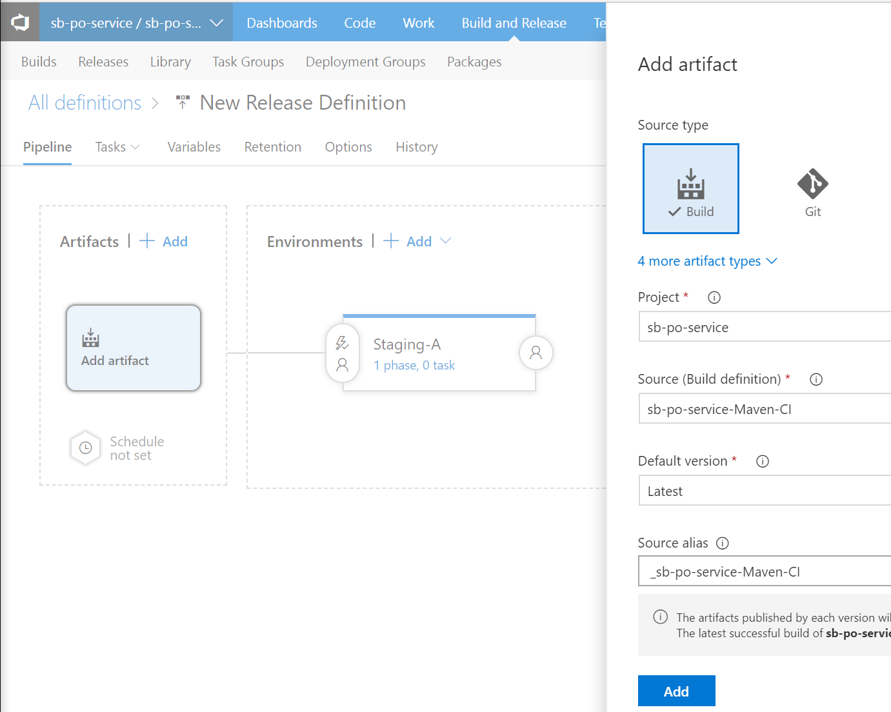

    Click on **Add**.

    Change the name of the *Release pipeline* as shown in the screenshot below.

    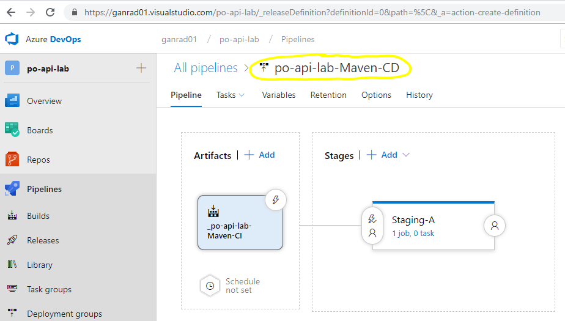

    In the *Pipeline* tab, click on the *trigger* icon (highlighted in yellow) and enable **Continuous deployment trigger**.  See screenshot below.

    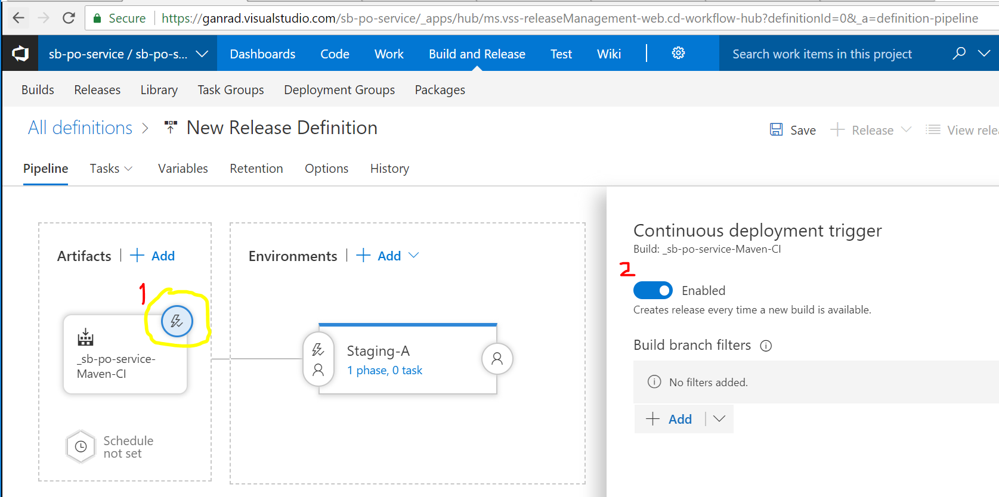

    Next, click on *1 job, 0 task* in the **Stages** box under environment *Staging-A*.  Click on *Agent job* under the *Tasks* tab and make sure **Agent pool** value is set to *Hosted VS2017*.  Leave the remaining field values as is.  See screenshots below.

    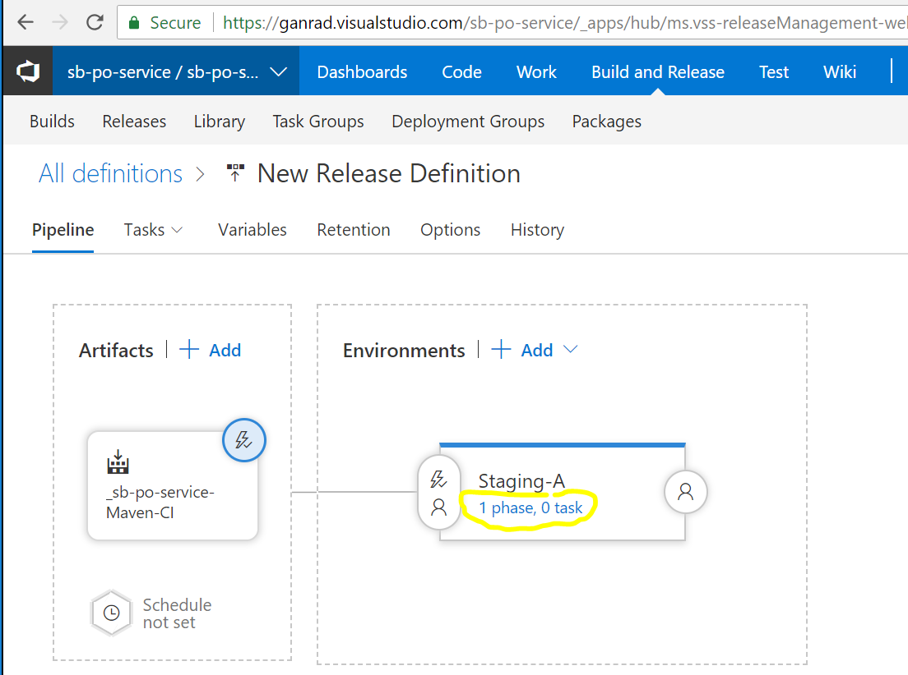

    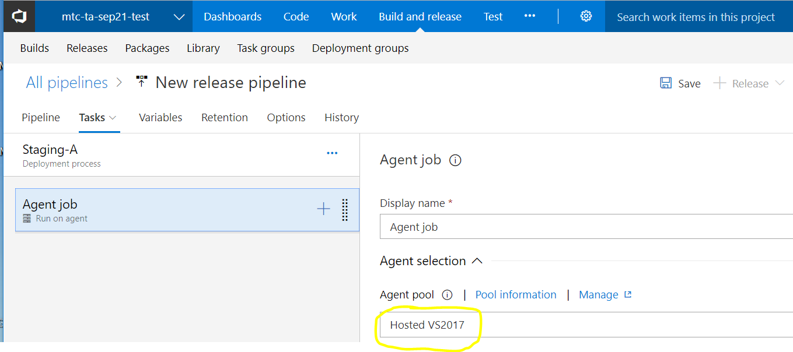

    Recall that we had installed a **Tokenizer utility** extension in VSTS in Step [C].  We will now use this extension to update the container image *Tag value* in Kubernetes deployment manifest file *./k8s-scripts/app-update-deploy.yaml*.  Open/View the deployment manifest file in an editor (vi) and search for variable **__Build.BuildNumber__**.  When we re-run (execute) the *Build* pipeline, it will generate a new tag (Build number) for the *po-service* container image.  The *Tokenizer* extension will then substitute the latest tag value in the substitution variable.

    Click on the ** + ** symbol beside **Agent job** and search for text **Tokenize with** in the *Search* text box (besides **Add tasks**). Click on **Add**.  See screenshot below.

    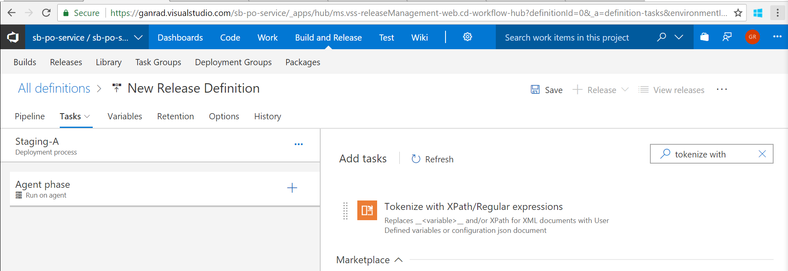

    Click on the **Tokenizer** task and click on the ellipsis (...) besides field **Source filename**.  In the **Select a file or folder** tab, select the deployment manifest file **app-update-deploy.yaml** from the respective folder as shown in the screenshots below. Click **OK**.

    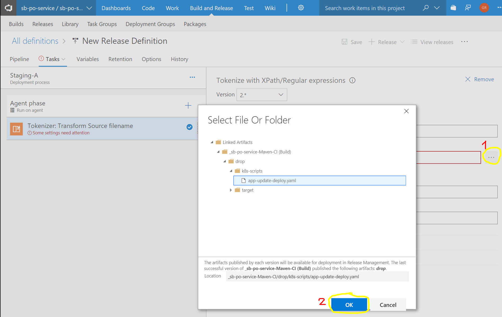

    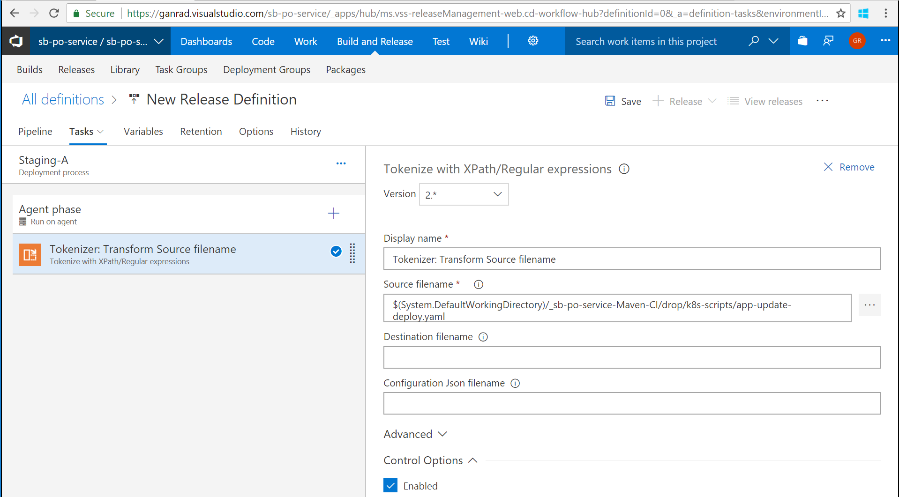

    Again, click on the ** + ** symbol beside **Agent job** and search for text **Deploy to Kubernetes**, select this extension and click **Add**.  See screenshot below.

    

    Click on the **Deploy to Kubernetes** task on the left panel and fill out the details as shown in the screenshot below.  This task will **apply** (update) the changes (image tag) to the kubernetes **Deployment** object on the Azure AKS cluster and do a **Rolling** deployment for the **po-service** microservice application.

    If you do not see your Kubernetes Cluster in the drop down menu, you will need to add it.  You can select `+NEW` and then fill out the information.  You will need the API Address, which you can find if you view your Kubernetes Cluster within the portal.  It will look similar to `akslab-ae1a2677.hcp.centralus.azmk8s.io`  Be sure to add `https://` before it when pasting it into Azure DevOps for `Server URL`.

    Additionally you will need your Kubernetes Configuration file from earlier.  Simply copy the contents in full to the `KubeConfig` section.

    After filling out all the field values (as shown), click **Save** on the top panel.  Provide a comment and click **OK**.

    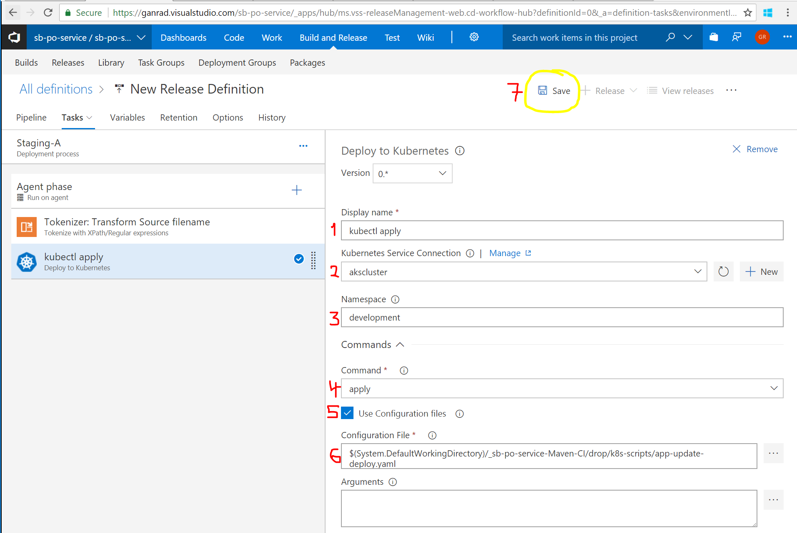

    We have now finished defining the **Release pipeline**.  This pipeline will in turn be triggered whenever the build pipeline completes Ok.

2.  In the po-service deployment manifest file **'./k8s-scripts/app-update-deploy.yaml'**, update the container **image** attribute value by specifying the name of your ACR repository.  You can make this change locally on your cloned repository (on the Linux VM) and then push (git push) the updates to your GitHub repository.  Alternatively, you can make this change directly in your GitHub repository (via web browser).  Search for the **image** attribute in file **'app-update-deploy.yaml'** and specify the correct **name** of your ACR repository (eg., Replace ACR_NAME in **ACR_NAME.azurecr.io**).  

3.  Edit the build pipeline and click on the **Triggers** tab.  Click the checkbox for both **Enable continuous integration** and **Batch changes while a build is in progress**.  Leave other fields as is.  Click on **Save & queue** menu and select the **Save** option.

    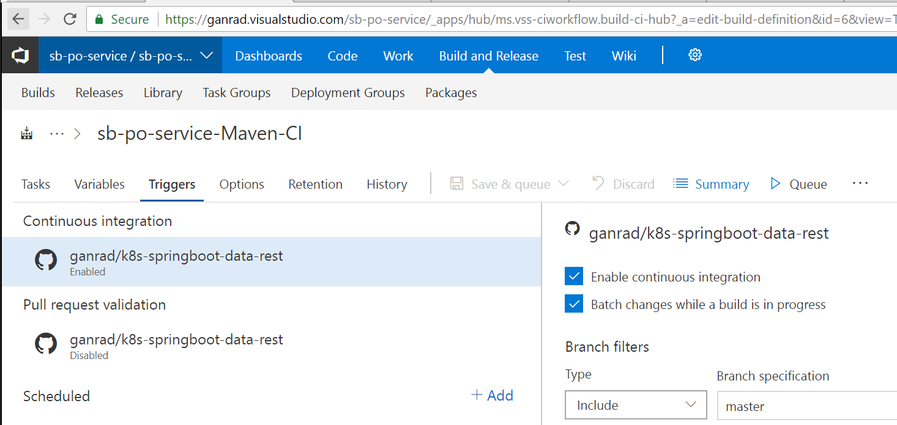

4.  Modify the microservice code to calculate **Discount amount** and **Order total** for purchase orders.  These values will be returned in the JSON response for the **GET** API (operation).  
    Update the `src/main/java/ocp/s2i/springboot/rest/model/PurchaseOrder.java` class in your forked GitHub repository by using one one of these options.
    - Use Git CLI to update this Java class in your cloned repository on the Linux host.  Then commit and push the updates to your forked GitHub repository.
    - Alternatively, update this Java class using the browser by accessing your forked GitHub repository.

    The changes to be made to the Java Class are described below.

    Open a web browser tab and navigate to your forked project on GitHub.  Go to the **model** sub directory within **src** directory and click on **PurchaseOrder.java** file.  See screenshot below.

    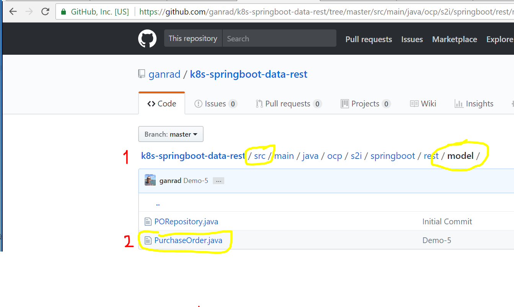

    Click on the pencil (Edit) icon on the top right of the code view panel (see below) to edit this file.

    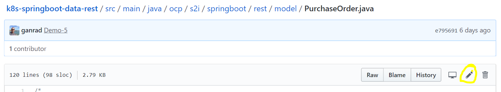

    Uncomment lines 100 thru 108 (highlighted in yellow).

    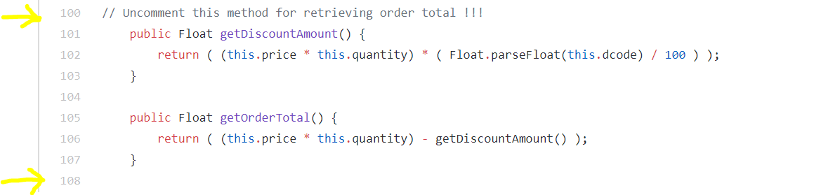

    Provide a comment and commit (save) the file.  The git commit will trigger a new build (**Continuous Integration**) for the **po-service** microservice in Azure DevOps.  Upon successful completion of the build process, the updated container images will be pushed into the ACR and the release pipeline (**Continuous Deployment**) will be executed.   As part of the CD process, the Kubernetes deployment object for the **po-service** microservice will be updated with the newly built container image.  This action will trigger a **Rolling** deployment of **po-service** microservice in AKS.  As a result, the **po-service** containers (*Pods*) from the old deployment (version 1.0) will be deleted and a new deployment (version 2.0) will be instantiated in AKS.  The new deployment will use the latest container image from the ACR and spin up new containers (*Pods*).  During this deployment process, users of the **po-service** microservice will not experience any downtime as AKS will do a rolling deployment of containers.

5.  Switch to a browser window and test the **po-Service** REST API.  Verify that the **po-service** API is returning two additional fields (*discountAmount* and *orderTotal*) in the JSON response.

    Congrats!  You have successfully used DevOps to automate the build and deployment of a containerized microservice application on Kubernetes.  

In this project, we experienced how DevOps, Microservices and Containers can be used to build next generation applications.  These three technologies are changing the way we develop and deploy software applications and are at the forefront of fueling digital transformation in enterprises today!

Next, continue to explore other container solutions available on Azure.  Use the links below.
- Proceed to the sub-project [Jenkins CI/CD](https://github.com/ganrad/k8s-springboot-data-rest/tree/master/extensions/jenkins-ci-cd) to learn how to implement a **Continuous Delivery** pipeline in **Jenkins** to build and release the *po-service* microservice to AKS.
- Proceed to the sub-project [Automate with Azure PaaS](https://github.com/ganrad/k8s-springboot-data-rest/tree/master/extensions/po-deploy-azuredb-mysql) to learn how to build and deploy a containerized microservice application using only **Azure PaaS** services.  Learn how to refactor the *po-service* microservice to persist *Purchase Order* data in a **Azure database for MySQL** (managed) server instance.  This sub-project will also detail the steps for deploying the *po-service* microservice on **Azure Container Instances**.
- Proceed to the sub-project [Manage APIs](https://github.com/ganrad/k8s-springboot-data-rest/tree/master/extensions/azure-apim) to learn how to secure, manage and analyze Web API's using **Azure API Management** Service.  This sub-project will describe the steps for securing the API's exposed by *po-service* microservice using Azure APIM PaaS.

### Appendix A
In case you want to change the name of the *MySQL* database name, root password, password or username, you will need to make the following changes.  See below.

- Update the *Secret* object **mysql** in file *./k8s-scripts/mysql-deploy.yaml* file with appropriate values (replace 'xxxx' with actual values) by issuing the commands below.
```bash
# Create Base64 encoded values for the MySQL server user name, password, root password and database name. Repeat this command to generate values for each property you want to change.
$ echo "xxxx" | base64 -w 0
# Then update the corresponding parameter value in the Secret object.
```

- Update the *./k8s-scripts/app-deploy.yaml* file.  Specify the correct value for the database name in the *ConfigMap* object **mysql-db-name** parameter **mysql.dbname** 

- Update the *Secret* object **mysql-sql** in file *./k8s-scripts/app-deploy.yaml* file with appropriate values (replace 'xxxx' with actual values) by issuing the commands below.
```bash
# Create Base64 encoded values for the MySQL server user name and password.
$ echo "mysql.user=xxxx" | base64 -w 0
$ echo "mysql.password=xxxx" | base64 -w 0
# Then update the *db.username* and *db.password* parameters in the Secret object accordingly.
```

### Troubleshooting
- In case you created the **po-service** application artifacts in the wrong Kubernetes namespace (other than `development`), use the commands below to clean all API objects from the current namespace.  Then follow instructions in Section D starting Step 6 to create the API objects in the 'development' namespace.
```bash
#
# Delete replication controllers - mysql, po-service
$ kubectl delete rc mysql
$ kubectl delete rc po-service
#
# Delete service - mysql, po-service
$ kubectl delete svc mysql
$ kubectl delete svc po-service
#
# Delete secrets - acr-registry, mysql, mysql-secret
$ kubectl delete secret acr-registry
$ kubectl delete secret mysql
$ kubectl delete secret mysql-secret
#
# Delete configmap - mysql-db-name
$ kubectl delete configmap mysql-db-name
```

- In case you want to delete all API objects in the 'development' namespace and start over again, delete the 'development' namespace.  Also, delete the 'dev' context.  Then start from Section D Step 5 to create the 'development' namespace, create the API objects and deploy the microservices.
```bash
# Make sure you are in the 'dev' context
$ kubectl config current-context
#
# Switch to the 'akscluster' context
$ kubectl config use-context akscluster
#
# Delete the 'dev' context
$ kubectl config delete-context dev
#
# Delete the 'development' namespace
$ kubectl delete namespace development
```

- A few useful Kubernetes commands.
```bash
# List all user contexts
$ kubectl config view
#
# Switch to a given 'dev' context
$ kubectl config use-context dev
#
# View compute resources (memory, cpu) consumed by pods in current namespace.
$ kubectl top pods
#
# List all pods
$ kubectl get pods
#
# View all details for a pod - Start time, current status, volume mounts etc
$ kubectl describe pod <Pod ID>
```
