#  Build and deploy a Java Springboot microservice application on Azure Kubernetes Service (AKS) running on Microsoft Azure.

In a nutshell, you will work on the following activities.
1.  Build a containerized Springboot Java Microservice Application (version 1.0) using VSTS (Visual Studio Team Services).  This step will constitute the **Continuous Deployment** step.
2.  Deploy the containerized Java Springboot microservice application in Azure Kubernetes Service (AKS) running on Azure
3.  Update application code (version 2.0) and then re-build and re-deploy the containerized application to AKS.  This step will constitute the **Continuous Integration** step.

**Prerequisities:**
1.  A Visual Studio Team Services Account.  If required, create a free VSTS account by accessing the [Visual Studio Team Services](https://www.visualstudio.com/team-services/) website.
2.  An active Microsoft Azure subscription.  If required, you can obtain a free subscription by accessing the [Microsoft Azure](https://azure.microsoft.com/en-us/?v=18.12) website.

This Springboot application demonstrates how to build and deploy a *Purchase Order* microservice as a containerized application (po-service) on Azure Kubernetes Service (AKS) on Microsoft Azure. The deployed microservice supports all CRUD operations on purchase orders.

### A] Deploy a VSTS application build agent in a separate Azure VM
This agent will be used by VSTS to run application and container builds.  Follow instructions below to create a Linux VM and deploy the VSTS build (docker) container.

1.  Open a command terminal on your workstation.  This tutorial requires you to run the Azure CLI version 2.0.4 or later.  If you need to install or upgrade Azure CLI, see [install Azure CLI 2.0](https://docs.microsoft.com/en-us/cli/azure/install-azure-cli?view=azure-cli-latest) on your workstation.

2.  An Azure resource group is a logical container into which Azure resources are deployed and managed.  So let's start by first creating a **Resource Group** using the Azure CLI.  Alternatively, you can use Azure Portal to create this resource group.  
```
az group create --name myResrouceGroupVM --location westus
```

3.  Use the command below to create a **CentOS 7.4** VM on Azure.  Make sure you specify the correct **resource group** name and provide a value for the *password*.  Once the command completes, it will print the VM connection info. in the JSON message (response).  Note down the public IP address, login name and password info. so that we can connect to this VM using SSH (secure shell).
```
az vm create --resource-group myResourceGroup --name k8s-lab --image OpenLogic:CentOS:7.4:7.4.20180118 --size Standard_B2s --generate-ssh-keys --admin-username labuser --admin-password <password> --authentication-type password
```

4.  Open a terminal window and SSH into the VM.  Substitute your public IP address in the command below.
```
$ ssh labuser@x.x.x.x
```

5.  (Optional) Install OpenJDK 8 on the VM.  See commands below.
```
$ sudo yum install -y java-1.8.0-openjdk-devel
$ java --version
```

6.  Next, install **docker-ce** container runtime. Refer to the commands below.
```
$ sudo yum update
$ sudo yum install -y yum-utils device-mapper-persistent-data lvm2
$ sudo yum-config-manager --add-repo https://download.docker.com/linux/centos/docker-ce.repo
$ sudo yum install docker-ce-18.03.0.ce
$ sudo systemctl enable docker
$ sudo groupadd docker
$ sudo usermod -aG docker labuser
```

LOGOUT AND RESTART YOUR VM BEFORE PROCEEDING

```
$ sudo docker info
```

7.  Pull the Microsoft VSTS agent container from docker hub.  It will take a few minutes to download the image.
```
$ docker pull microsoft/vsts-agent
$ docker images
```

8.  Next, we will generate a VSTS personal access token (PAT) to connect our VSTS build agent to your VSTS account.  Login to VSTS using your account ID. In the upper right, click on your profile image and click **security**.  


Click on **Add** to create a new PAT.  In the next page, provide a short description for this token, select a expiry period and click **Create Token**.  See screenshot below.


In the next page, make sure to **copy and store** the PAT (token) into a file.  Keep in mind, you will not be able to retrieve this token again.  Incase you happen to lose or misplace the token, you will need to generate a new PAT and use it to reconfigure the VSTS build agent.  So save this PAT (token) to a file.

9.  Use the command below to start the VSTS build container.  Substitute the correct value for **VSTS_TOKEN** parameter, the value which you copied and saved in a file in the previous step.  The VSTS build agent will initialize and you should see a message indicating "Listening for Jobs".
```
docker run -e VSTS_ACCOUNT=ganrad -e VSTS_TOKEN=<xyz> -v /var/run/docker.sock:/var/run/docker.sock --name vstsagent -it microsoft/vsts-agent
```

### B] Deploy Azure Container Registry (ACR)
In this step, we will deploy an instance of Azure Container Registry to store container images which we will build in the next steps.  A container registry such as ACR allows us to store multiple versions of application container images in one centralized repository and consume them from multiple nodes (VMs/Servers) where our applications are deployed.

1.  Login to your Azure portal account.  Then click on **Container registries** in the navigational panel on the left.  If you don't see this option in the nav. panel then click on **All services**, scroll down to the **COMPUTE** section and click on the star beside **Container registries**.  This will add the **Container registries** option to the service list in the navigational panel.  Now click on the **Container registries** option.  You will see a page as displayed below.


2.  Click on **Add** to create a new ACR instance.  Give a meaningful name to your registry, select an Azure subscription, select the **Resource group** which you created in step [A] and choose a location.  Enable the **Admin user** option and managed registry.  Select the **Basic** pricing tier (if applicable).  Click **Create** when you are done.


### C] Create a new Build definition in VSTS to deploy the Springboot microservice
In this step, we will define the tasks for building the microservice (binary artifacts) application and packaging (layering) it within a docker container.  The build tasks use **Maven** to build the Springboot microservice & **docker-compose** to build the application container.  During the application container build process, the application binary is layered on top of a base docker image (CentOS 7).  Finally, the built application container is pushed into ACR which we deployed in step [B] above.

Before proceeding with the next steps, feel free to inspect the dockerfile and source files in the GitHub repository (under src/...).  This will give you a better understanding of how continous deployment (CD) can be easily implemented using VSTS.

1.  Fork this GitHub repository.

2.  If you haven't already done so, login to VSTS using your account ID and create a new VSTS project. Give a name to your VSTS project.

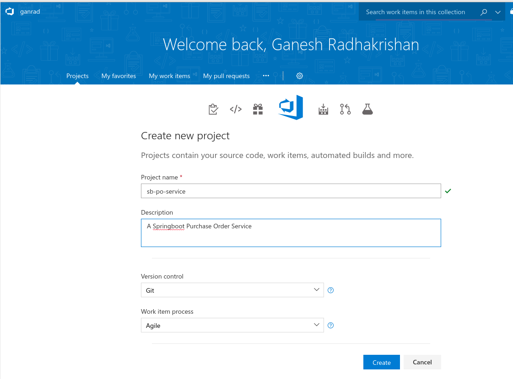

3.  We will now create a **Build** definition and define tasks which will execute as part of the application build process.  Click on **Build and Release** in the top menu and then click on *Builds*.  Click on **New definition**

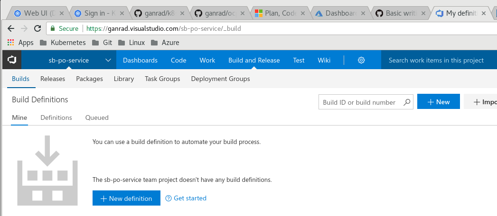

4.  In the **Select a source** page, select *GitHub* as the source repository. Give your connection a name and then select *Authorize using OAuth* link.  Optionally, you can use a GitHub *personal access token* instead of OAuth.  When prompted, sign in to your **GitHub account**.  Then select *Authorize* to grant access to your VSTS account.

5.  Once authorized, select the **GitHub Repo** which you forked in step [1] above.  Then hit continue.

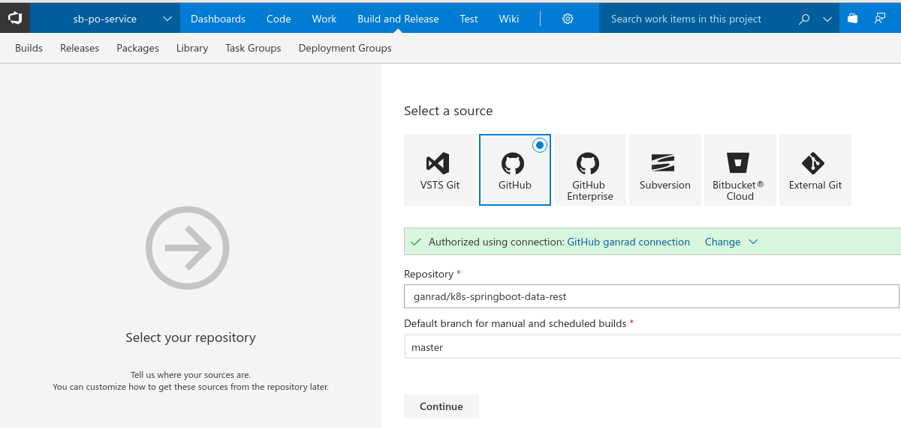

6.  Search for text *Maven* in the **Select a template** field and then select *Maven* build.  Then click apply.

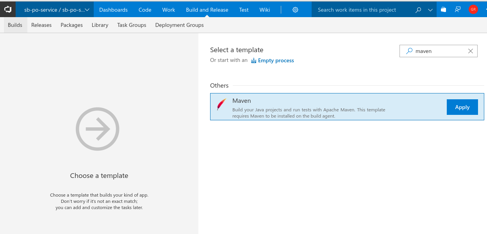

7.  Select *Default* in the **Agent Queue** field.  The VSTS build agent which you deployed in step [A] connects to this *queue* and listens for build requests.

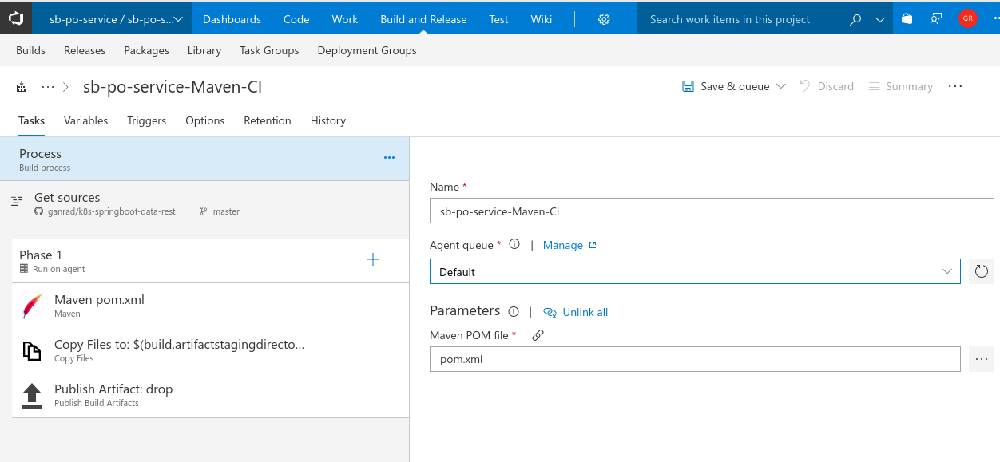

8.  On the top extensions menu in VSTS, click on **Browse Markplace** and then search for text *replace tokens*.  In the results list below, click on **Colin's ALM Corner Build and Release Tools** (circled in yellow in the screenshot).  Then click on **Get it free** to install this extension in your VSTS account.


9.  Go back to your build definition and click on the plus symbol beside **Phase 1**.  Search by text *replace tokens* and then select the extension **Replace Tokens** which you just installed in the previous step.  Click **Add**.


10.  Click on the **Replace Tokens** task and drag it to the top of the task list.  In the **Source Path** field, select *src/main/resources* and specify *.properties in the **Target File Pattern** field.  In the **Token Regex** field, specify __(\w+[.\w+]*)__ as shown in the screenshot below.  In the next step, we will use this task to specify the target kubernetes service name and namespace name.

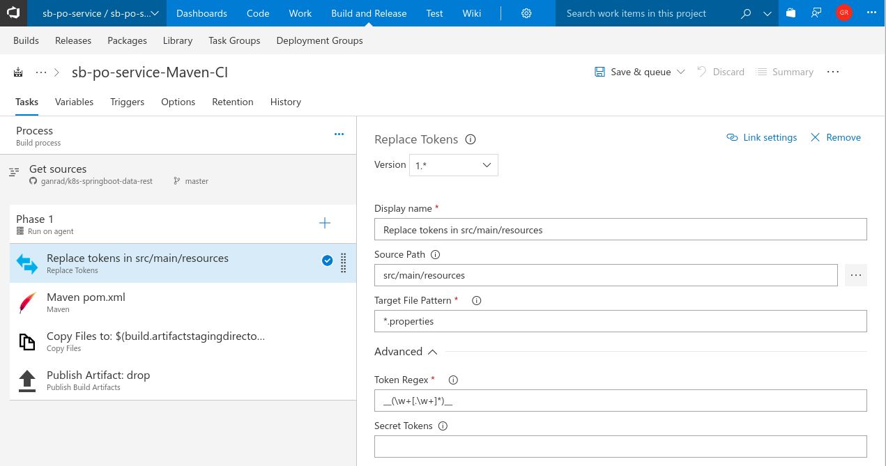

11.  Click on the **Variables** tab and add a new variable to specify the Kubernetes service name and namespace name as shown in the screenshot below.
```
svc.name.k8s.namespace mysql.development
```

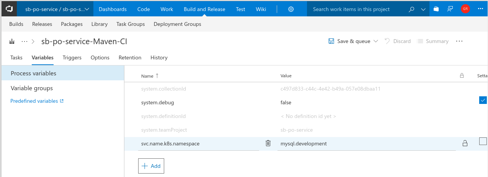

12.  Switch back to the **Tasks** tab and click on the **Maven** task.  Specify values for fields **Goal(s)**, **Options** as shown in the screen shot below.  Ensure **Publish to TFS/Team Services** checkbox is enabled.

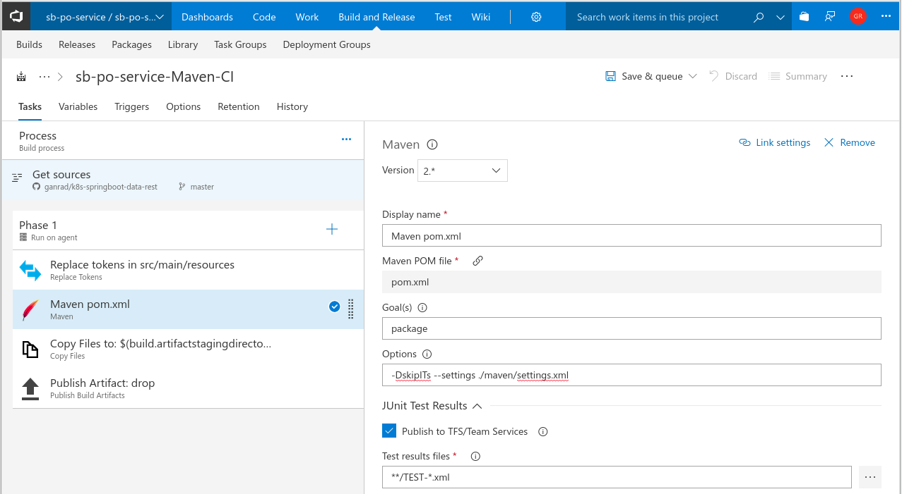

13.  Go thru the **Copy Files...** and **Publish Artifact:...** tasks.  These tasks copy the application binary artifacts (*.jar) to the **drop** location on the VSTS server.

14.  Next, we will package our application binary within a container.  Review the **docker-compose.yml** and **Dockerfile** files in the source repository to understand how the application container image is built.  Click on the plus symbol to add a new task. Search for task *Docker Compose* and click **Add**.

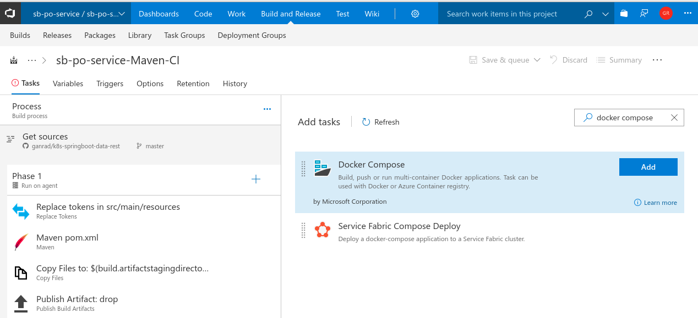

15.  Click on the *Run a Docker Compose ...* task on the left panel.  Specify *Azure Container Registry* for **Container Registry Type**.  In the **Azure Subscription** field, select your Azure subscription.  Click on **Authorize**.  In the **Azure Container Registry** field, select the ACR which you created in step [B] above.  Check to make sure the **Docker Compose File** field is set to **/docker-compose.yml.  Enable **Qualify Image Names** checkbox.  In the **Action** field, select *Build service images* and also enable **Include Latest Tag** checkbox.  See screenshot below.


16.  Once our application container image has been built, we will push it into the ACR.  Add another task to publish the container image built in the previous step to ACR. Repeat step [15] and search for task *Docker Compose* and click **Add**.

17.  Click on the *Run a Docker Compose ...* task on the left.  Specify *Azure Container Registry* for **Container Registry Type**.  In the **Azure Subscription** field, select your Azure subscription.  In the **Azure Container Registry** field, select the ACR which you created in step [B] above.  Check to make sure the **Docker Compose File** field is set to **/docker-compose.yml.  Enable **Qualify Image Names** checkbox.  In the **Action** field, select *Push service images* and also enable **Include Latest Tag** checkbox.  See screenshot below.


18.  Click **Save and Queue** to save the build definition and queue it for execution. Wait for the build process to finish.  When all build tasks complete OK and the build process finishes, you will see the screen below.

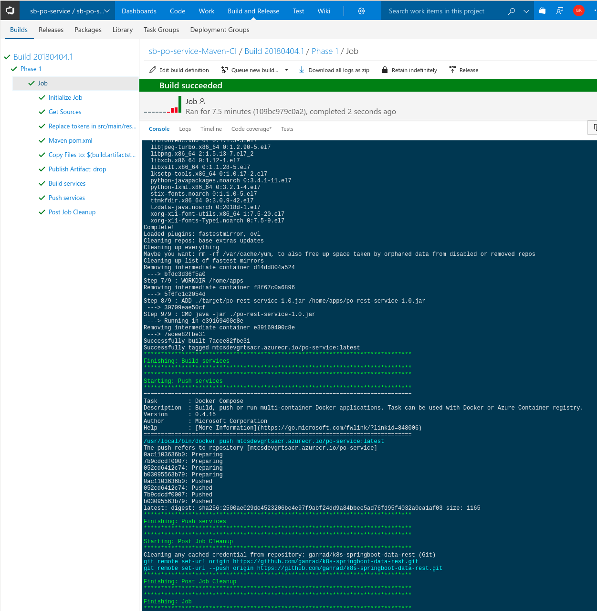

In the VSTS build agent terminal window, you will notice that a build request was received from VSTS and processed successfully. See below.

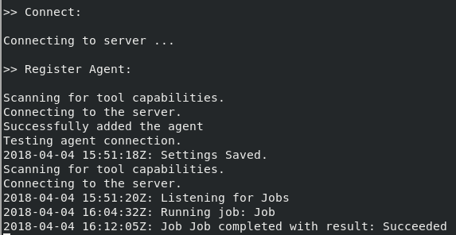

### D] Create an Azure Kubernetes Service (AKS) cluster and deploy our Springboot microservice.
In this step, we will first deploy an AKS cluster on Azure.  Our Springboot **Purchase Order** microservice application reads/writes purchase order data from/to a relational (MySQL) database.  So we will deploy a **MySQL** database container (ephemeral) first and then deploy our Springboot Java application.  All application deployments to a **Kubernetes** cluster are managed by manifest (yaml/json) files.  These manifest files contain Kubernetes object (resource) definitions.

Kubernetes manifest files for deploying the **MySQL** and **po-service** (Springboot application) containers are provided in the **k8s-scripts/** folder in the GitHub repository.  There are two manifest files in this folder **mysql-deploy.yaml** and **app-deploy.yaml**.  As the names suggest, the *mysql-deploy* manifest file is used to deploy the **MySQL** database container and the other file is used to deploy the **Springboot** microservice respectively.

Before proceeding with the next steps, feel free to inspect the Kubernetes manifest files to get a better understanding of the following.  These are all out-of-box capabilities provided by Kubernetes.
-  How confidential data such as database user names & passwords are injected (at runtime) into the application container using **Secrets**
-  How application configuration information such as database connection URL and the database name parameters are injected (at runtime) into the application container using **ConfigMaps**
-  How environment variables such as the MySQL listening port is injected (at runtime) into the application container.
-  How services in Kubernetes can auto discover themselves using the built-in **Kube-DNS** proxy.


In case you want to modify the default passwords for MySQL, database name, database connection parameters (JDBC URL...), you can do the changes in the respective manifest files.

First, create a new project in OpenShift using the Web Console (UI).
First, create a new project in OpenShift using the Web Console (UI).
Name the project as *myproject*.
### B] Deploy a ephemeral MySql database server instance (Pod) in OpenShift.
Name the application as *mysql*.  Specify the following values for the database parameters
```
Database service name = mysql
Database name = sampledb
Database user name = mysql
Database password = password
```
### C] Deploy the *Purchase Order* microservice application on OpenShift CP.
1.  Download *mysqldb.properties* and *mysql-secret.yaml* files from this project to your local machine.
2.  For this po-service application, we will store the MySql database name in a *ConfigMap* and inject this value into our po-service application Pod.  Use the commands below to create the *mysql-db-name* ConfigMap in your project and list it's contents.
```
oc create configmap mysql-db-name --from-file=./mysqldb.properties
oc get configmaps mysql-db-name -o yaml
```
3.  We will store the MySql database user name and password in a *Secret* and inject these values into the application Pod. Next, generate a *Base64* encoded value for the MySql server user name and password. See the commands below.
```
$ echo "mysql.user=mysql" | base64 -w 0
$ echo "mysql.password=password" | base64 -w 0
```
4.  Substitute the *Base64* encoded values for the MySql server user name and password in the *mysql-secret.yaml* file as shown below.
```
apiVersion: v1
kind: Secret
metadata:
  name: mysql-secret
data:
  db.username: bXlzcWwudXNlcj1teXNxbAo=
  db.password: bXlzcWwucGFzc3dvcmQ9cGFzc3dvcmQK
```
5. Create the secret API object in your project/namespace.
```
$ oc create -f mysql-secret.yaml
```
6. List the secret objects in your project/namespace.
```
$ oc get secrets
```
7. Add the *mysql-secret* secret to the default Service Account.
```
$ oc secrets add serviceaccount/default secret/mysql-secret --for=mount
```
8. Use the OpenShift Web Console (UI) to deploy the Springboot application instance (Pod) in OpenShift. Name the application as *po-service*.  Allow the application build to finish and the application Pod to come up (start).  The application Pod will start and terminate as we have not injected the secret (*mysql-secret*) containing the database user name and password into the Pod yet.  We will do this in the next step.
9.  Use the command below to mount the *mysql-db-name" ConfigMap into your appliction Pod.
```
$ oc volume dc/po-service --add --name=mysqlcm --type=configmap --configmap-name='mysql-db-name' --mount-path='/etc/config'
```
The above command will trigger a new application deployment.  Wait for the deplooyment to finish.

10.  Use the command below to mount the *mysql-secret* Secret into your application Pod.
```
$ oc volume dc/po-service --add --name=mysqlse --type=secret --secret-name='mysql-secret' --mount-path='/etc/vol-secrets'
```
The above command will trigger another application deployment.  Wait for the deployment to finish.  As soon as the deployment finishes, the *po-service* application Pod should start Ok.  The application should now be able to connect to the backend MySql database.

11.  Test the microservice by using the *scripts* in the */scripts* directory.  The microservice exposes a HATEAS API and supports all CRUD operations on purchase orders.

12.  (Optional) Use the command below to export all API objects to a (reusable) template.  This template can be used for deploying the *po-service* applicaton along with all it's dependencies (MySql server, secrets, configmaps ...) in other regions easily.
```
$ oc export is,secret,configmap,bc,dc,svc,route --as-template=springboot-po-service -o json > kubernetes.json
```

13.  (Optional) Create a project *myproject* and import the application template into this project.
```
$ oc new-project myproject
$ oc create -f kubernetes.json
```

14.  (Optional) Use the OpenShift Web Console (UI) to deploy the *mysql* database server Pod and *po-service* microservice Pod with a single click.  Select the *springboot-po-service* template in the S2I application deployment wizard. 

Congrats!  You have just built and deployed a simple Springboot microservice on OpenShift CP.
