## Create an Azure Container Service (AKS) cluster and then use *Kubernetes Dashboard* to deploy the *po-service* Springboot Java Microservice

In order to access the Kubernetes Dashboard (Web UI), a PC (or a VM) running MacOS or Linux Desktop OS such as Fedora/Ubuntu/Debian (any Linux flavor) will be required.  Alternatively, a Windows 10 PC running Ubuntu/Debian/SLES Linux OS on Windows Sub-System for Linux should also work.  Azure CLI v2.0.4 or later **should** be installed on this VM/Machine.  Refer to the [Azure CLI 2.0](https://docs.microsoft.com/en-us/cli/azure/install-azure-cli?view=azure-cli-latest) documentation to install Azure CLI on this machine.
For the remainder of this text, this machine (Linux/MacOS/Windows) will be referred to as the **Host** machine.

You will first deploy an AKS cluster on Azure using the Azure Portal.  You will then use the Kubernetes Dashboard (Web) UI to deploy the **MySQL** database and **po-service** application containers.

YAML files for deploying all required Kubernetes objects (API resources) are provided in the [k8s-scripts](./k8s-scripts) sub-directory.  Before proceeding with the next steps, we highly recommend that you go thru the Kubernetes object definition files in this directory.


### Provision the AKS cluster
1.  Open a terminal window on the **Host** machine & use Azure CLI to login to your Azure account.  Next, install **kubectl** which is a command line tool for administering and managing a Kubernetes cluster.  Refer to the commands below in order to install *kubectl*.
    ```
    # (Optional) Login to your Azure account.  Substitute correct values for <Azure account id> and <password>.
    $ az login -u <Azure account id> -p <password>
    #
    # Switch to your home directory
    $ cd
    #
    # Create a new directory 'aztools' under home directory to store the kubectl binary
    $ mkdir aztools
    #
    # Install kubectl binary in the new directory
    $ az aks install-cli --install-location=./aztools/kubectl
    #
    # Add the location of 'kubectl' binary to your search path and export it.
    # Alternatively, add the export command below to your '.bashrc' file in your home directory. Then logout of your Host (VM) from the terminal window and log back in for changes to take effect.  By including this command in your '.bashrc' file, you don't have to set the location of the 'kubectl' binary in the PATH environment variable and export it every time you open a new terminal window.
    $ export PATH=$PATH:/home/labuser/aztools
    #
    # Check if kubectl is installed OK
    $ kubectl version -o yaml
    ```

2.  Using a web browser, login to the [Azure portal](https://portal.azure.com) using your account ID and password.  Access the **Azure Active Directory** blade and verify that you have adequate permissions to register applications.  See screenshot below.

    

3.  Search for **Kubernetes services** PaaS service in **All services**. Click on the link to open up the blade (detail panel).  Then click on *Create Kubernetes service* button (or ** + Add ** new cluster in case you have already deployed other clusters).

    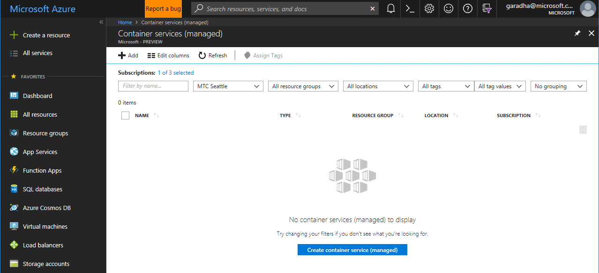

    In the *Basics* tab, specify values for **Subscription**, **Resource group**, **Kubernetes cluster name** & **DNS name prefix** as shown in the screenshot below.  Also, change the value of field **Node count** to **1** or else AKS will deploy a 3-node cluster (default).  Click **Next:Authentication**.

    

    In the *Authentication* tab, leave the default value for **Service principal** and click **Next:Networking**.

    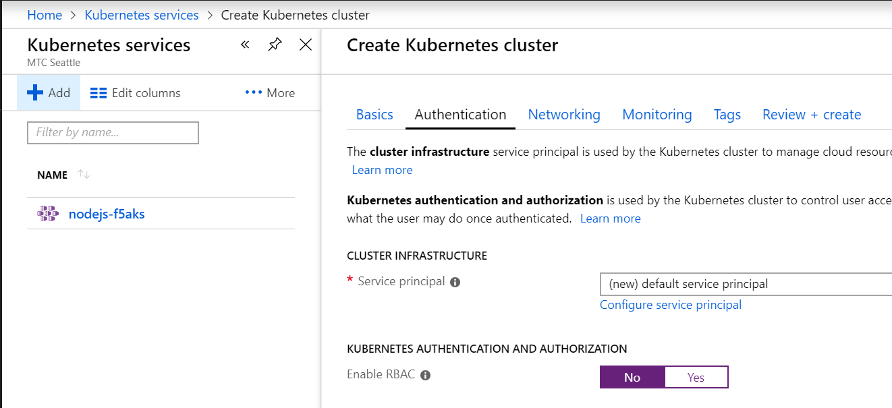

    Leave all the default values as-is on the **Networking** tab.  Click **Next:Monitoring**.

    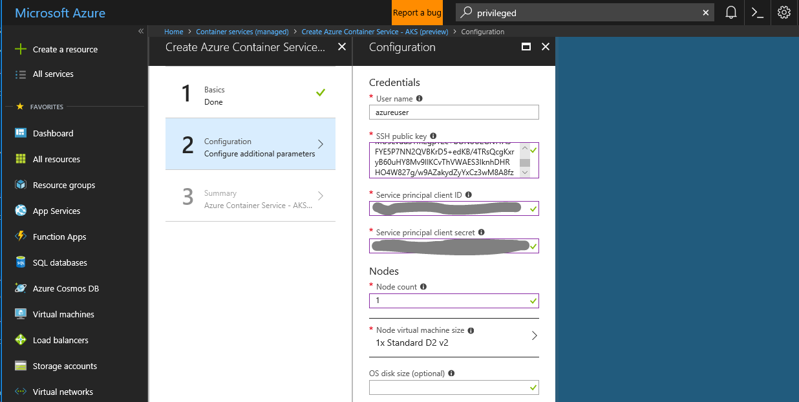

    Leave the default values on the **Monitoring** and **Tags** tabs and click on **Review + create** button.

    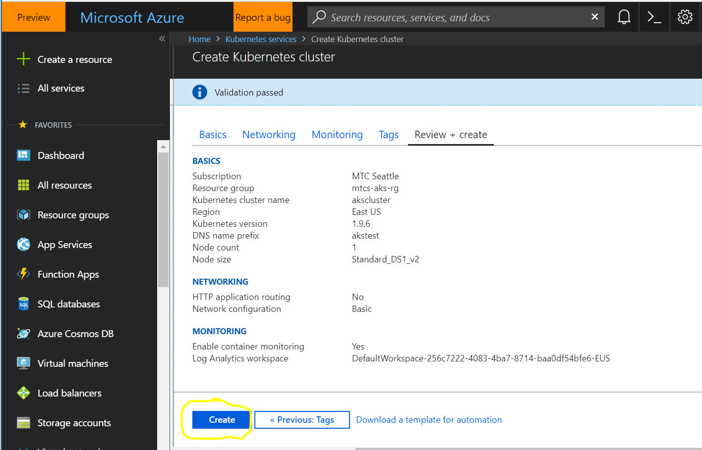

    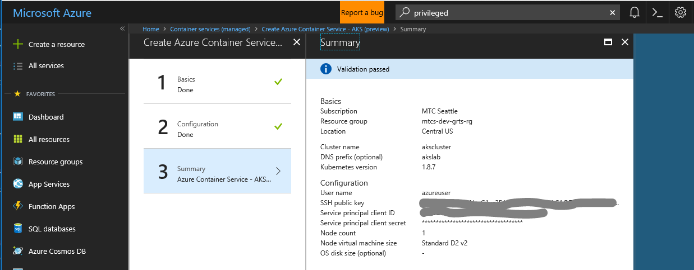

    In the summary page, review all the details and then click on **Create**.

    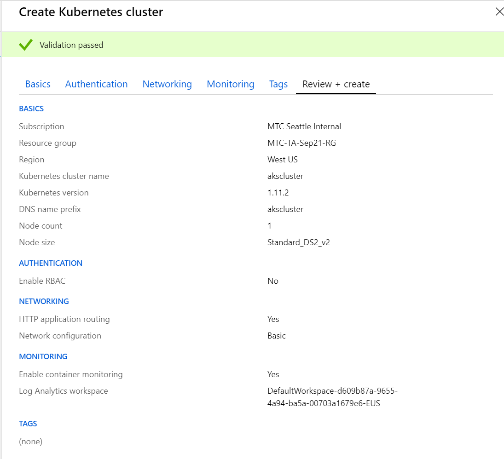

    The AKS cluster will take a few minutes (5-10 mins) to get provisioned.  Once the cluster creation process finishes, the **akscluster** cluster will be displayed in the list as shown in the screenshot below.

    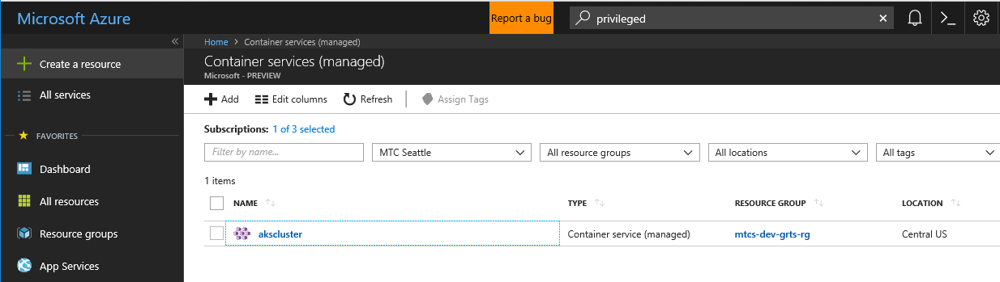

4.  Switch back to the *Host* terminal window and start the Kubernetes Dashboard proxy using **one** of the options listed below
    - Use the Kubernetes proxy (kubectl) to connect to Kubernetes Dashboard
    ```
    # Configure kubectl to connect to the AKS cluster
    $ az aks get-credentials --resource-group myResourceGroup --name akscluster
    #
    # Start the Kubernetes dashboard proxy
    $ kubectl proxy -p 8001
    ```
    - Use Azure AKS CLI to connect to the Kubernetes Dashboard
    ```
    # Configure kubectl to connect to the AKS cluster
    $ az aks get-credentials --resource-group myResourceGroup --name akscluster
    #
    # Start the Kubernetes dashboard by running the following command
    $ az aks browse --name akscluster --resource-group myResourceGroup
    ```

5.  Open another browser tab and point your browser to the Kubernetes dashboard URL [http://localhost:8001/api/v1/namespaces/kube-system/services/http:kubernetes-dashboard:/proxy/](http://localhost:8001/api/v1/namespaces/kube-system/services/http:kubernetes-dashboard:/proxy/)

6.  Next, create a new Kubernetes **namespace** called *development*.  In the Kubernetes **Dashboard**, click on *Namespaces* under *Cluster* on the left navigational panel.  Then click on *CREATE* link on the top.  This will open up a YAML/JSON editor (shown below).  Cut and paste the contents of file **./k8s-scripts/dev-namespace.json** into the editor, then click *Upload*.  See the screenshots below.  Alternatively, use the *Create From File* tab to upload an YAML/JSON file containing Kubernetes resource/object definition and create corresponding object on the Kubernetes API Server.

    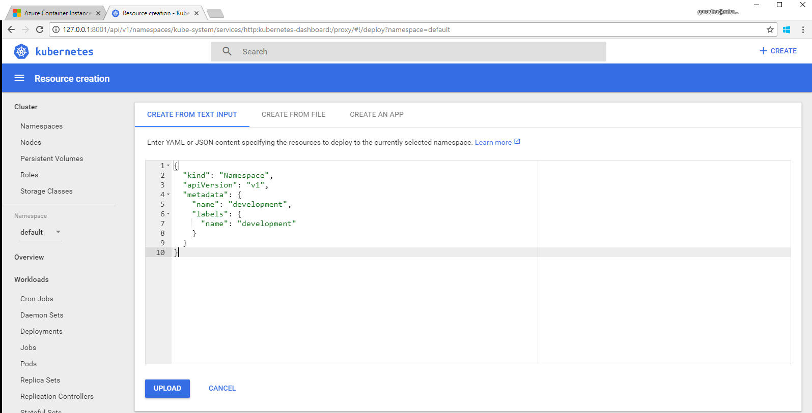

    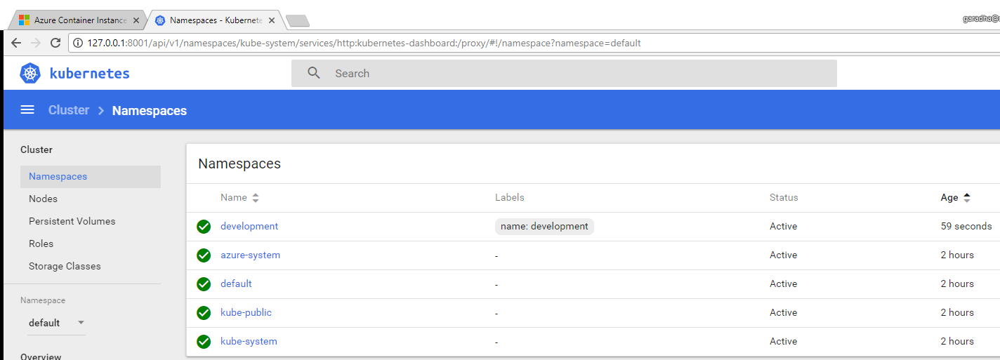

7.  Before proceeding, make sure you have selected the **development** namespace in the Kubernetes Dashboard UI.  This is extremely important. Otherwise the Kubernetes API objects might get created in the wrong namespace (eg., default).  See the screenshot below.

    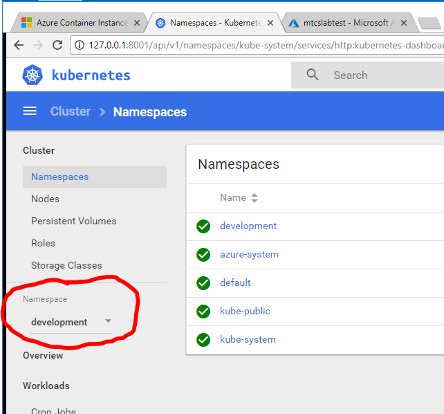

8.  Switch back to the terminal window.  Create the **dev** Kubernetes context and make it the current context.  We will be deploying the **MySQL** and **po-service** application pods and all associated Kubernetes resources (objects) within this namespace.
    ```
    # Create the 'dev' context.  Remember to specify correct values for 'Resource Group' and 'AKS Cluster' names in the '--user' parameter.
    # eg., --user=clusterUser_<Resource Group Name>_<AKS Cluster Name>
    $ kubectl config set-context dev --cluster=akscluster --user=clusterUser_myResourceGroup_akscluster --namespace=development
    #
    # Switch the current context to 'dev'
    $ kubectl config use-context dev
    #
    # Check your current context (should list 'dev' in the output)
    $ kubectl config current-context
    ```

9.  Configure Kubernetes to pull application container images from ACR. When AKS cluster is created, Azure also creates a 'Service Principal' (SP) to support cluster operability with other Azure resources.  This auto-generated service principal can be used to authenticate against the ACR.  To do so, we need to create an Azure AD role assignment that grants the cluster's SP access to the Azure Container Registry.  In a Linux terminal window, update the shell script `./k8s-scripts/acr-auth.sh` with correct values for the following variables.

    Variable | Description
    ----------------- | -------------------
    AKS_RESOURCE_GROUP | Name of the AKS resource group
    AKS_CLUSTER_NAME | Name of the AKS cluster instance
    ACR_RESOURCE_GROUP | Name of the ACR resource group
    ACR_NAME | Name of ACR instance

    Then execute this shell script.  See below.

    ```
    # chmod 700 ./k8s-scripts/acr-auth.sh
    #
    # Update the shell script and then run it
    $ ./k8s-scripts/acr-auth.sh
    #
    ```

If you are familiar with Kubernetes API/Object model, you can skip to [Deploy All Kubernetes API Objects](#deploy-all-kubernetes-api-objects).

If you are new to Kubernetes, proceed with the next step.

### Deploy Kubernetes API Objects Step By Step

In this section, you will deploy all Kubernetes API objects step by step. This will help you understand the relationships between the objects (Kubernetes API/Object Model), how everything ties together.  

1.  Use the Kubernetes Dashboard (Web UI) to deploy the **MySQL** database resources on Kubernetes.
    -  Create the MySQL Secret API object.  Click on *Secrets* link on the left navigational panel and then click on *Create* link on the top.  Cut and paste the contents of file *./k8s-scripts/mysql-secret.yaml* into the editor and click *UPLOAD*.  Alternatively, you can also use the *Create From File* option to upload the contents of this file and create the Secret API object.

       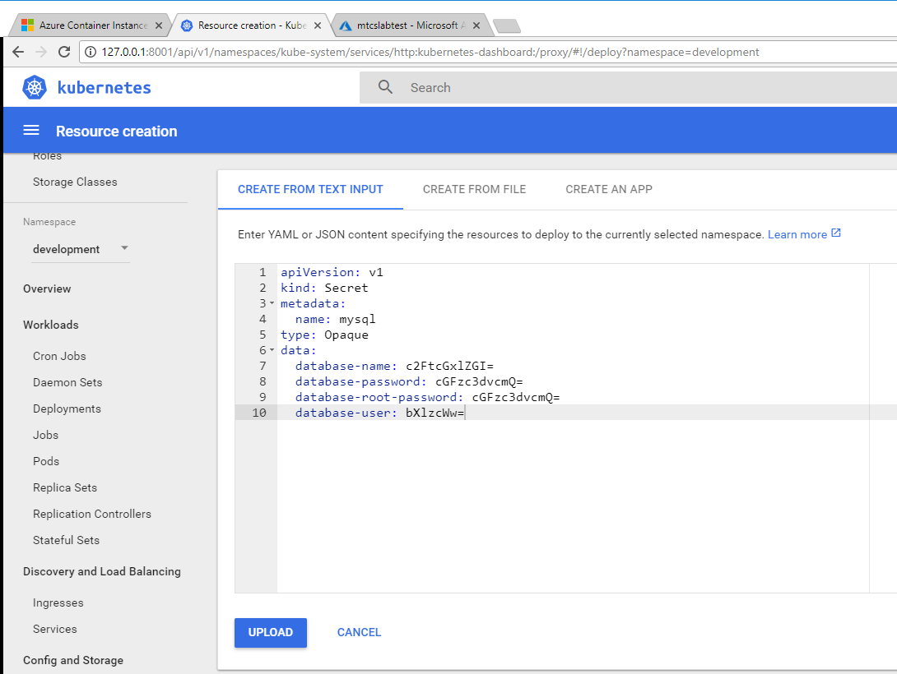

       

    -  Create the MySQL Service API object.  Click on the *Services* link on the left navigational panel and then click on *Create* link on the top.  Cut and paste the contents of file *./k8s-scripts/mysql-svc.yaml* into the editor and then click *UPLOAD*.  Alternatively, use the *Create From File" option to upload the contents of this file and create the Service API object.

       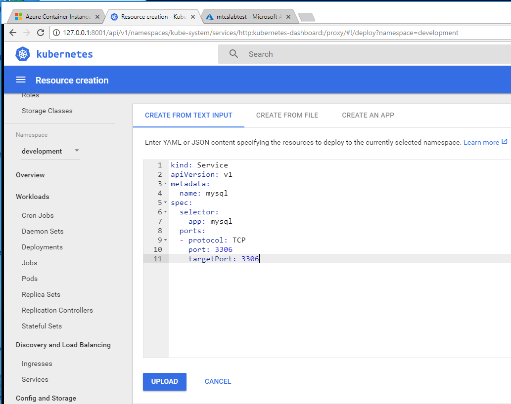

       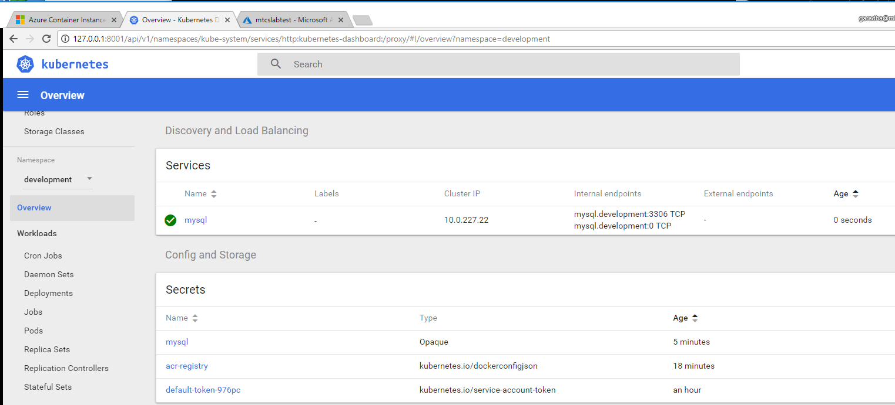

    -  Create the MySQL *Deployment* API object.  Click on the *Deployments* link on the left navigational panel and then click on *Create* link on the top.  Cut and paste the contents of file *./k8s-scripts/mysql-deployment.yaml* into the editor and then click *UPLOAD*.  Alternatively, use the *Create From File" option to upload the contents of this file and create the Kubernetes Deployment API object.

       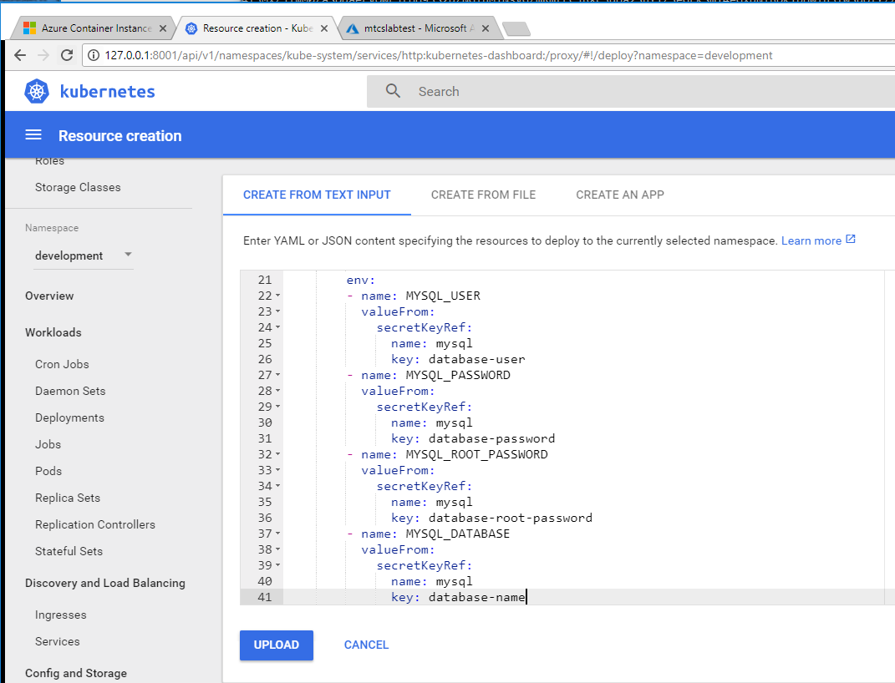

       

       You may have to refresh the web page to view the status of the Kubernetes API objects.

       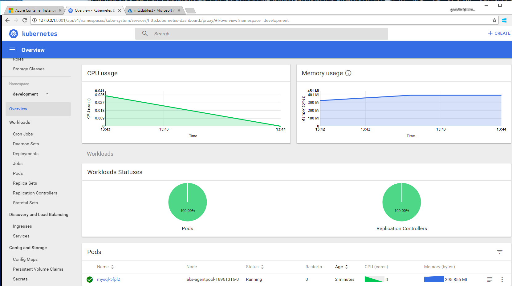

2.  Update the file **k8s-scripts/app-deployment.yaml**.  The *image* attribute should point to **your** ACR instance.  This will ensure AKS pulls the application container image from the correct registry.  Substitute the correct value for the ACR *registry name* in the *image* attribute (highlighted in yellow) within the *containers section* as shown in the screenshot below.

    

3.  Use the Kubernetes Dashboard (Web UI) to deploy the **po-service** Springboot application resources on Kubernetes.
    -  Create the Config Map API object.  Click on *Config Maps* link on the left navigational panel and then click on *Create* link on the top.  Cut and paste the contents of file *./k8s-scripts/app-config-map.yaml* into the editor and click *UPLOAD*.  Alternatively, you can also use the *Create From File* option to upload the contents of this file and create the Configmap API object.

       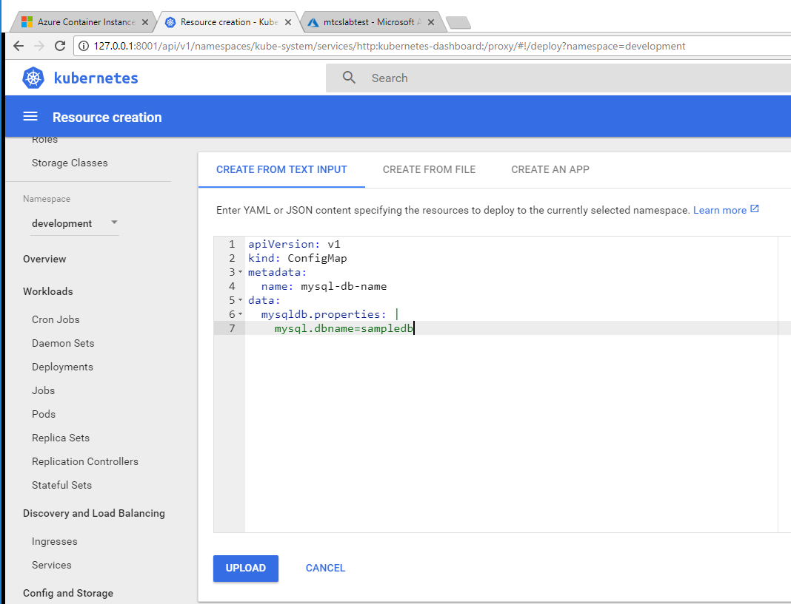

       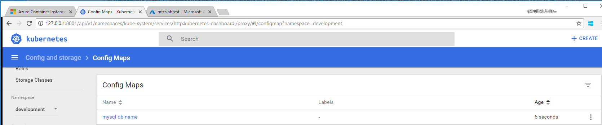

    -  Create the Secret API object.  Click on the *Secrets* link on the left navigational panel and then click on *Create* link on the top.  Cut and paste the contents of file *./k8s-scripts/app-mysql-secret.yaml* into the editor and then click *UPLOAD*.  Alternatively, use the *Create From File" option to upload the contents of this file and create the Secret API object.

       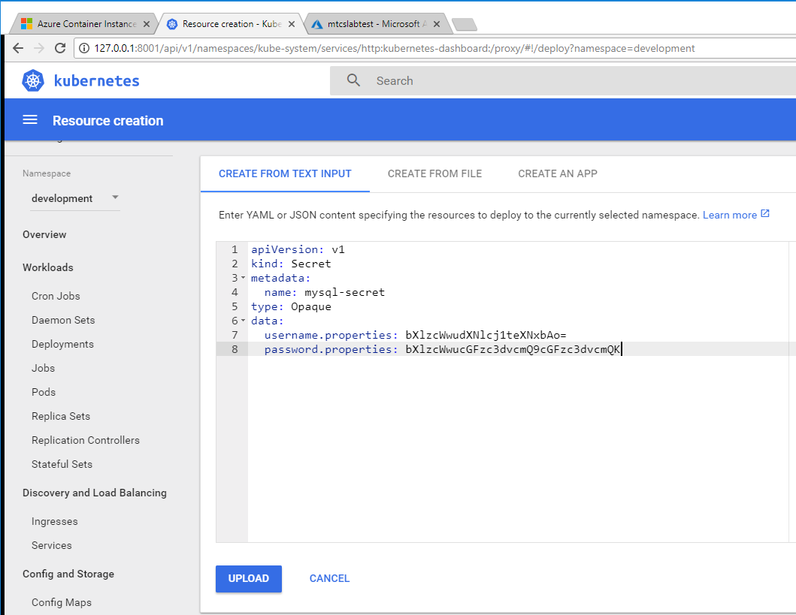

       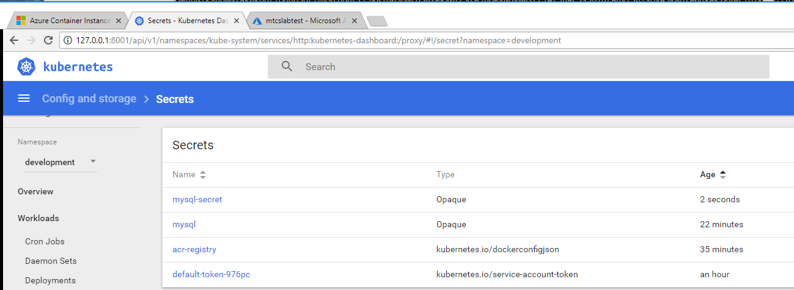

    -  Create the Service API object.  Click on the *Services* link on the left navigational panel and then click on *Create* link on the top.  Cut and paste the contents of file *./k8s-scripts/app-service.yaml* into the editor and then click *UPLOAD*.  Alternatively, use the *Create From File" option to upload the contents of this file and create the Service API object.

       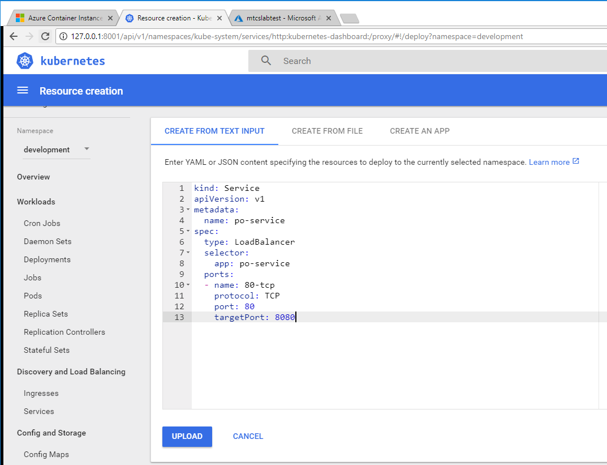

       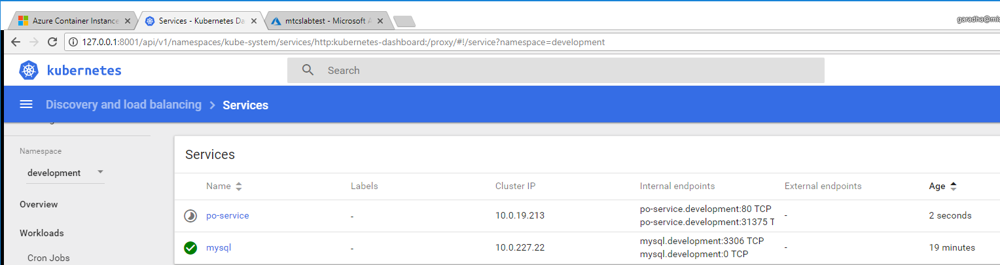

    -  Create the po-service *Deployment* API object.  Click on the *Deployments* link on the left navigational panel and then click on *Create* link on the top.  Cut and paste the contents of file *./k8s-scripts/app-deployment.yaml* into the editor and then click *UPLOAD*.  Alternatively, use the *Create From File" option to upload the contents of this file and create the Kubernetes Deployment API object.

       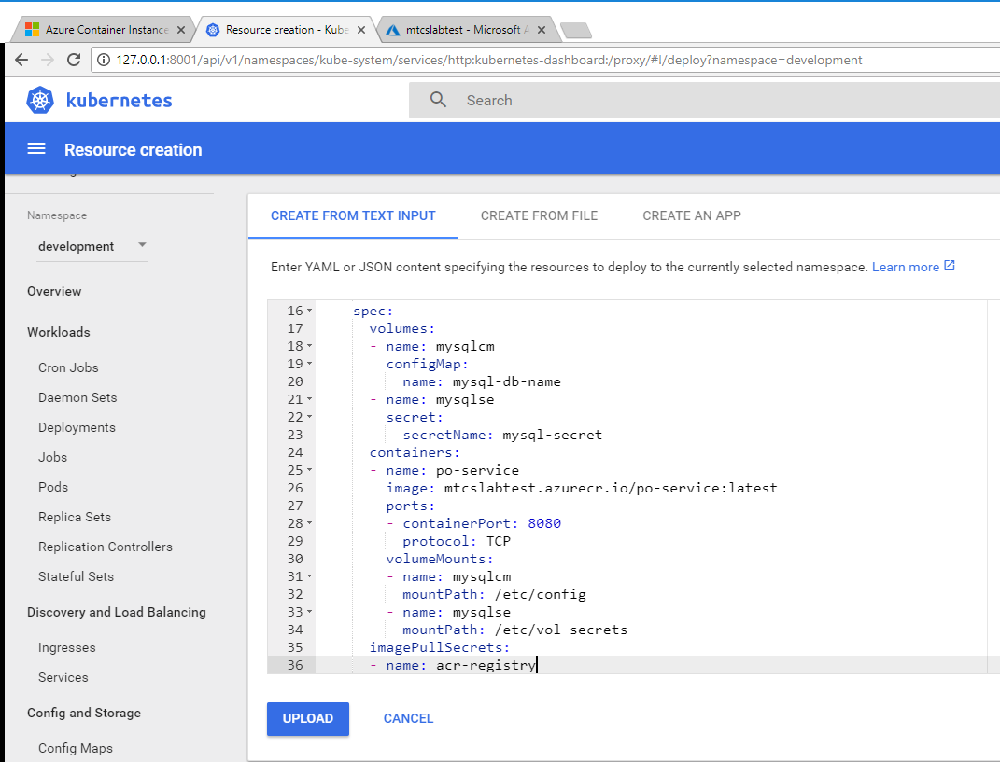

       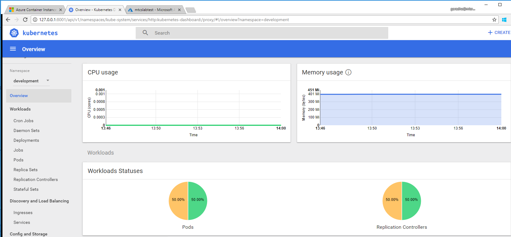

       You may have to refresh the web page to view the status of the Kubernetes API objects.

       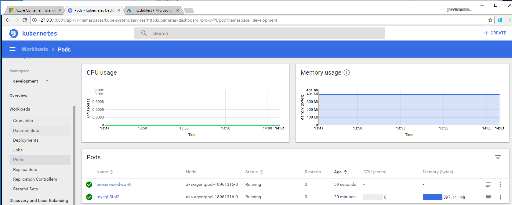

You can now go back to the [k8s-springboot-data-rest](https://github.com/ganrad/k8s-springboot-data-rest#accessing-the-purchase-order-microservice-rest-api) GitHub project and follow the instructions for testing the **po-service** microservice application.

### Deploy All Kubernetes API Objects

In this section, you will use the Kubernetes Dashboard UI to deploy all Kubernetes API objects to AKS.   A single Kubernetes manifest file will be used to deploy all application artifacts.

**NOTE:** The **k8s-scripts/deploy-app.yaml** file deploys a **ephemeral** MySQL database server container on AKS.  This implies, when the Kubernetes **deployment** object corresponding to the MySQL application is deleted (Pod is terminated/deleted), the storage space used by the MySQL container will also be deleted and the data stored in the MySQL databases will be lost.

For deploying a **persistent** MySQL database server container, review and then update the file **k8s-scripts/deploy-app-persistent.yaml** instead of **k8s-scripts/deploy-app.yaml**.  The persistent MySQL container uses an **Azure Disk** to persist the MySQL databases.  Essentially, all data stored within the MySQL databases will be persisted in a disk and will not be lost when the MySQL **deployment** object is deleted.  The data will only be deleted when the corresponding **Persistent Volume Claim** object is deleted.

1.  Update the file **k8s-scripts/deploy-app.yaml**.  The *image* attribute should point to **your** ACR instance.  This will ensure AKS pulls the application container image from the correct registry.  Substitute the correct value for the ACR *registry name* in the *image* attribute (highlighted in yellow) within the deployment API object (*containers section*) as shown in the screenshot below.

    

2.  Use the Kubernetes Dashboard (Web UI) to deploy the Springboot application resources on Kubernetes.  In the **Overview** page of the Kubernetes Dashboard UI, click on **CREATE** link on the top.  Cut and paste the contents of file *./k8s-scripts/deploy-app.yaml* into the editor and click *UPLOAD*.  Alternatively, you can also use the *Create From File* option to upload the contents of this file.  The Kubernetes runtime will create all the API objects and deploy the *po-service* Springboot microservice & *MySQL* database service containers.

    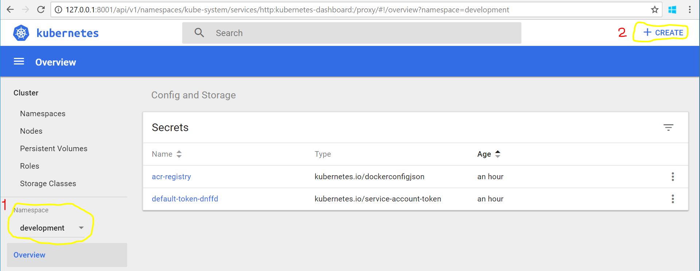

    

    

    

You can now go to the [k8s-springboot-data-rest](https://github.com/ganrad/k8s-springboot-data-rest#accessing-the-purchase-order-microservice-rest-api) GitHub project and follow the steps for testing the **po-service** microservice application.
