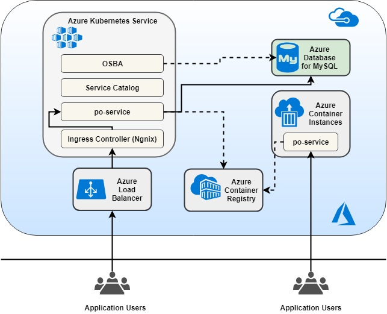
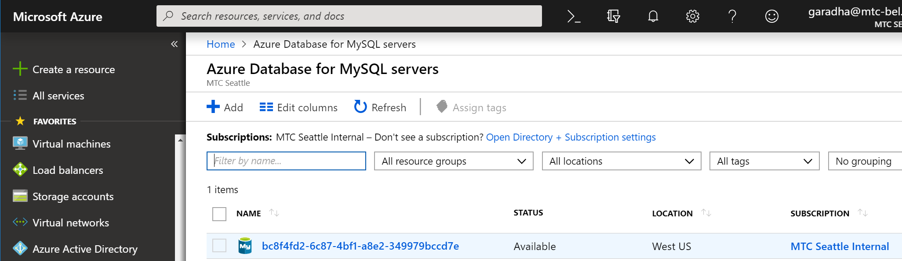
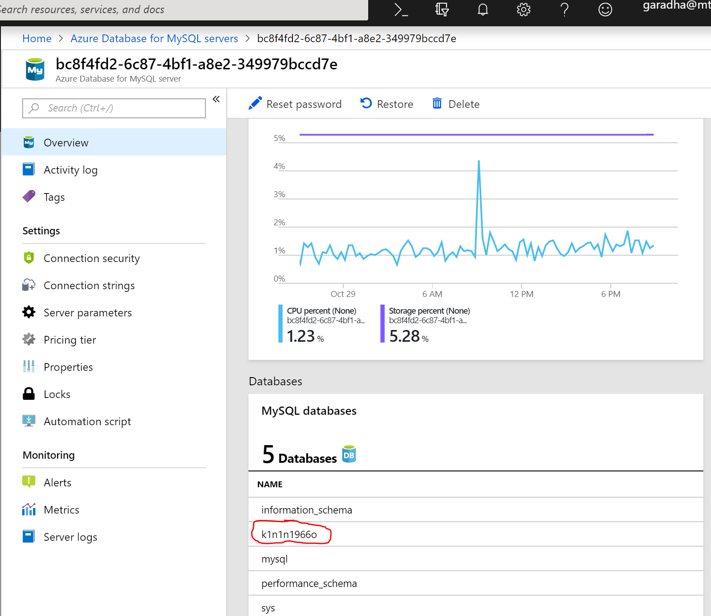
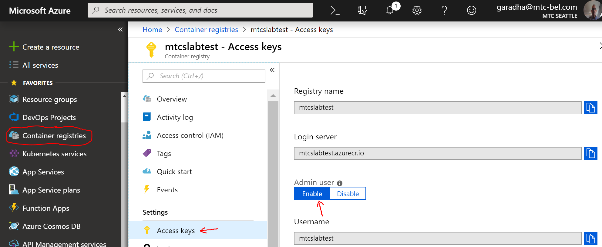
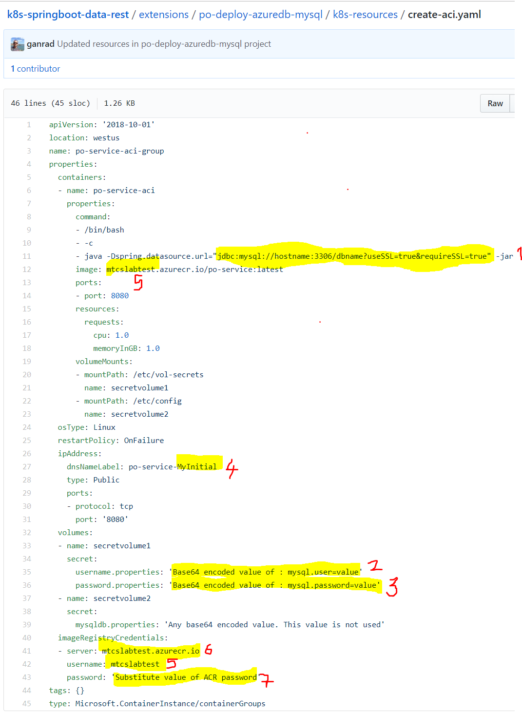
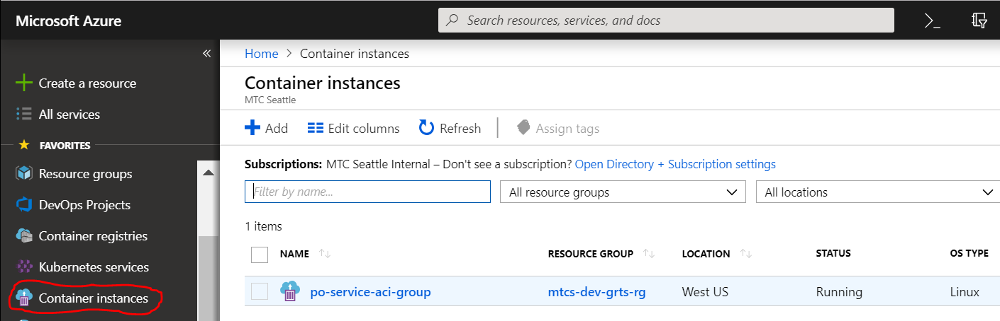
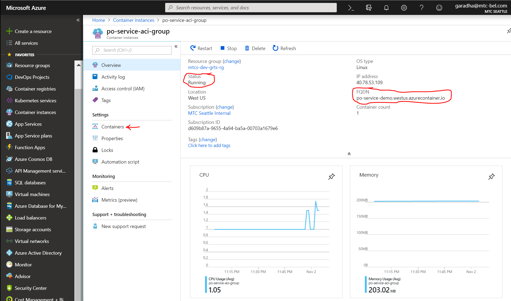
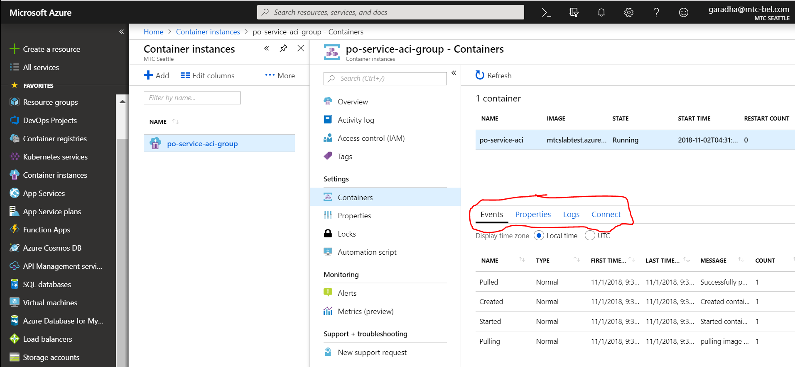
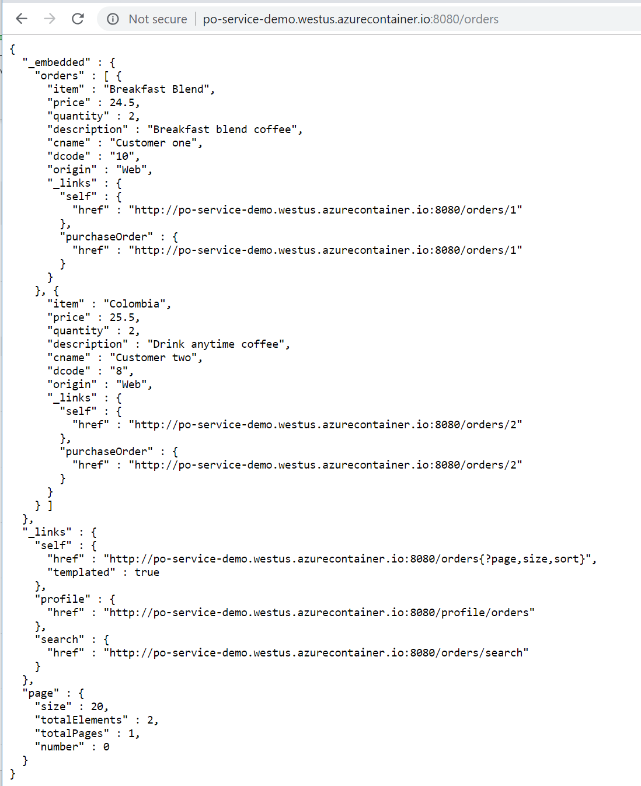

## Use *Azure Database for MySQL* (PaaS) as the persistent data store for the po-service microservice application.

The overall goal of this sub-project (extension) is summarized below.
- Demonstrate the use of **Open Service Broker for Azure** to provision and deploy a managed MySQL database server (instance) on Azure. OSBA is an implementation of *Open Service Broker API* specification and is used to expose public cloud services (PaaS) on container platforms such as AKS.  Applications deployed on container platforms can then seamlessly provision and consume public cloud (PaaS) services from DevOps pipelines.
- Demonstrate the use of **Helm** (CLI) for deploying containerized applications on Kubernetes (AKS).  Helm is a package manager for Kubernetes and is a part of [CNCF](https://www.cncf.io/). Helm is used for managing Kubernetes packages called *Charts*.  In layman's terms, a chart is a bundle of Kubernetes manifest files necessary to create an instance of a Kubernetes application.
- Demonstrate how to secure a microservice (REST API) end-point using SSL/TLS (HTTPS transport) and expose it thru the **Ingress Controller** addon on AKS.
- Demonstrate the serverless container solution by deploying the *po-service* microservice on **Azure Container Instances** (ACI).

**Prerequisites:**
1.  Before working on the hands-on labs in this project, readers are required to complete all hands-on labs (Sections) in the [parent project](https://github.com/ganrad/k8s-springboot-data-rest).  In case you have come to this project directly, go back and finish the lab exercises in the parent project.
2.  Readers are required to be familiar with basic Linux commands.
3.  Readers are advised to refer to the CLI documentation for **kubectl**, **helm** & **svcat** as needed.  Links to documentation are provided below.

**Description:**

In this project, we will first deploy a managed MySQL database server on Azure using **Open Service Broker for Azure** (OSBA).  Following that, we will configure a MySQL database as the backend data store for the *po-service* microservice.

In a nutshell, you will work on the following tasks.
1. Install **Service Catalog** and **Open Service Broker for Azure (OSBA)** on AKS (Section [A])

   These components will be used to deploy managed PaaS services on Azure.

2. Use OSBA to deploy the **Azure Database for MySQL** instance (Section [B])

   The Service Catalog CLI will be used to provision a managed instance of MySQL on Azure.  The CLI will communicate with the OSBA API server on AKS to provision the managed PaaS service (MySQL) on Azure.

3. Use **Helm** to deploy the *po-service* microservice on AKS (Section [C])

   The microservice will use the managed MySQL instance on Azure to persist *Purchase Orders*.

4. Deploy the *po-service* microservice on **Azure Container Instance** (ACI) (Section [D])

   The microservice will use the managed MySQL instance on Azure to persist *Purchase Orders*.

**Functional Architecture:**



For easy and quick reference, readers can refer to the following on-line resources as needed.
- [Helm](https://docs.helm.sh/)
- [Open Service Broker API](https://www.openservicebrokerapi.org/)
- [Install Service Catalog CLI](https://svc-cat.io/docs/install/#installing-the-service-catalog-cli)
- [Azure Service Catalog CLI Documentation](https://github.com/Azure/service-catalog-cli)
- [Azure Container Instances Documentation](https://docs.microsoft.com/en-us/azure/container-instances/)

**Important Notes:**
- Keep in mind that this is an **Advanced** lab for experienced Kubernetes users.  Before starting to work on the hands-on labs in this project, complete all sections in the parent project.

### A] Install *Service Catalog* and *Open Service Broker for Azure* (OSBA) on AKS
**Approx. time to complete this section: 45 mins to an hour**

Open a terminal window and use SSH to login to the Linux VM (Bastion Host) which you provisioned on Azure in the parent project.

1.  Add **Service Catalog** chart to the Helm repository.
    ```
    $ helm repo add svc-cat https://svc-catalog-charts.storage.googleapis.com
    ```
    Run Helm to install **Service Catalog** containers on AKS.  The command below assumes the AKS cluster is not RBAC-enabled.  If your cluster is RBAC enabled, do not specify the *rbacEnable* flag when running the command.
    ```
    # If your cluster is not RBAC-enabled, run this command.
    $ helm install svc-cat/catalog --name catalog --namespace catalog --set rbacEnable=false --set controllerManager.healthcheck.enabled=false
    # If your cluster is RBAC-enabled, use the command below.
    # helm install svc-cat/catalog --name catalog --namespace catalog --set controllerManager.healthcheck.enabled=false
    ```
    The Service Catalog containers (Pods) will be deployed in the **catalog** namespace on AKS.  Use the command below to verify the catalog API service is installed.
    ```
    $ kubectl get apiservice
    ```
    The output of the above command should be as listed below (truncated for brevity).  The **v1beta1.servicecatalog.k8s.io** API service should be listed in the output. 
    ```
    NAME                                    AGE
    v1.                                     31d
    v1.apps                                 31d
    v1.authentication.k8s.io                31d
    v1.authorization.k8s.io                 31d
    v1.autoscaling                          31d
    ....
    v1beta1.servicecatalog.k8s.io           6d
    v1beta1.storage.k8s.io                  31d
    v1beta2.apps                            31d
    v2beta1.autoscaling                     31d
    ```

2.  Add **Open Service Broker for Azure** chart to the Helm repository.
    ```
    $ helm repo add azure https://kubernetescharts.blob.core.windows.net/azure
    ```
    Create an Azure Service Pricipal (SP) and assign `Contributor` role access to this SP.  This SP will be used by Open Service Broker for Azure component (containers) to provision PaaS services (MySQL) on Azure.  Use the provided shell script to create the SP.
    ```
    $ ./shell-scripts/create-sp-sub.sh
    ```
    The shell script should output a JSON and also save the output in a txt file *SP_SUB.txt* in the current directory.  Next, set environment variables by substituting the correct values as output by the SP creation command and run Helm to install the **Open Service Broker for Azure** containers on AKS.
    ```
    # Replace correct values for all environment variables before running this shell script !!!!
    #
    # Set the Azure client ID
    $ AZURE_CLIENT_ID=<appId>
    #
    # Set the Azure client secret
    $ AZURE_CLIENT_SECRET=<password>
    #
    # Set the Azure AD tenant ID
    $ AZURE_TENANT_ID=<tenant>
    #
    # Retrieve and set the user's Azure subscription ID in a variable
    $ AZURE_SUBSCRIPTION_ID=$(az account show --query id --output tsv)
    #
    # Install the Open Service Broker for Azure components using Helm.
    $ helm install azure/open-service-broker-azure --name osba --namespace osba \
      --set azure.subscriptionId=$AZURE_SUBSCRIPTION_ID \
      --set azure.tenantId=$AZURE_TENANT_ID \
      --set azure.clientId=$AZURE_CLIENT_ID \
      --set azure.clientSecret=$AZURE_CLIENT_SECRET
    #
    ```
    The Open Service Broker for Azure containers (Pods) will be deployed in the **osba** namespace on AKS.

3.  List the Pods for *Service Catalog* and *Open Service Broker for Azure* services (containers).  Ensure all *Pods* have a status of `Running` before proceeding with the next step.
    ```
    # List the Service Catalog Pods
    $ kubectl get pods -n catalog 
    #
    # List the OSBA Pods
    $ kubectl get pods -n osba 
    #
    ```

4.  Use the Service Catalog CLI to list all service brokers.
    **NOTE:** The Service Catalog CLI should have been on the Linux VM (Bastion Host) in the parent project.

    ```
    # List service brokers running on the AKS instance
    $ svcat get brokers
    #
    ```
    The output of the above command should be as listed below.
    ```
      NAME                                URL                                STATUS
    +------+---------------------------------------------------------------+--------+
      osba   https://osba-open-service-broker-azure.osba.svc.cluster.local   Ready
    ```
    List the available service classes and plans.
    ```
    # List the service classes
    $ svcat get classes
    #
    # List the service plans
    $ svcat get plans
    #
    ```

### B] Use OSBA to deploy the *Azure Database for MySQL* instance
**Approx. time to complete this section: 30-45 mins**

1.  Create a new namespace **dev-azure-mysql** using Kubernetes CLI.  This namespace will be used to deploy another instance of *po-service* microservice.  The important thing to bear in mind here is that this microservice instance will use a managed instance of MySQL running on Azure to persist Purchase Orders.  
    ```
    # Create a new namespace to deploy the 'po-service' microservice
    $ kubectl create namespace dev-azure-mysql
    #
    # List the namespaces
    $ kubectl get namespaces
    #
    ```
    
2.  Install an instance of **Azure Database for MySQL** using Kubernetes CLI.

    Edit the file `k8s-resources/mysql-dbms-instance.yaml` and review the **ServiceInstance** API object definition for the managed database server instance.  Ensure the **resourceGroup** attribute value in the API object specifies the name of the Azure *Resource Group* which you provisioned in the parent project.  Also, specify a unique value for attribute **alias**.  The deployment of the PaaS service will fail if this value is a duplicate of another service.

    Use Kubernetes CLI to create the managed MySQL database server instance on Azure as shown in the command snippet below.
    ```
    # Provision the managed MySQL database server instance on Azure
    $ kubectl create -f ./k8s-resources/mysql-dbms-instance.yaml
    #
    ```

    Before proceeding, make sure the MySQL database server got provisioned and has a status of **Ready**.  Use the command below to check the status of the **Service Instance**.

    ```
    # List the deployed service instances. Verify the service is in 'Ready' state
    $ svcat get instances -n dev-azure-mysql
               NAME                   NAMESPACE             CLASS           PLAN    STATUS
    +--------------------------------+-----------------+----------------------+-------+--------+
    po-service-mysql-dbms-instance   dev-azure-mysql   azure-mysql-5-7-dbms   basic   Ready
    #
    ```

    Note that for this project, we will be provisioning the managed MySQL server in a **basic** service plan (a.k.a Pricing Tier).  The **Basic** service plan supports a maximum of 2 vCPUs, 1TB of storage and up to 35 days of data retention.  You can view the available service plans for all Azure managed services exposed by OSBA using `svcat` CLI.   You can also use the **Azure Portal** to view the various plans supported by *Azure Database for MySQL* PaaS service.

    Edit the file `k8s-resources/mysql-database-instance.yaml` and review the **ServiceInstance** API object definition for the database instance.  In this file, update the value for *parentAlias* attribute by specifying the same value which you specified for *alias* attribute in the MySQL database server API definition.  The *alias* attribute value in the database server definition and *parentAlias* attribute value in the database definition should match and be the same.

    Use Kubernetes CLI to create the database instance on the MySQL server as shown in the command snippet below.

    ```
    # Provision the database instance on the MySQL server
    $ kubectl create -f ./k8s-resources/mysql-database-instance.yaml
    #
    ```

    Initially, the *Service Instance* will have a status of **Provisioning** and it will take a few minutes for the database to get provisioned.  Before proceeding, make sure the MySQL database got provisioned and has a status of **Ready**.

    Use the command below to check the status.

    ```
    # List the deployed service instances.  This command should show both the service instances which we have provisioned using OSBA.
    $ svcat get instances -n dev-azure-mysql
                 NAME                     NAMESPACE               CLASS               PLAN     STATUS
    +------------------------------------+-----------------+--------------------------+----------+--------+
    po-service-mysql-database-instance   dev-azure-mysql   azure-mysql-5-7-database   database   Ready
    po-service-mysql-dbms-instance       dev-azure-mysql   azure-mysql-5-7-dbms       basic      Ready
    #
    ```

    Login to the Azure Portal and verify the MySQL database server instance got created OK.  See screenshot below.

    

    Also, verify the MySQL database got created.  The database name will be an arbitary name chosen by Azure.  See screenshot below.

    

    Open the file `k8s-resources/mysql-database-binding.yaml` and review the **ServiceBinding** API object definition.  A *Service Binding* creates a Kubernetes **Secret** object containing the connection details for the managed MySQL database instance on Azure.  The *Secret* object contains data tuples (name=value) for the database URI, database name, username, password & port information.  The MySQL database connection information will be injected as environment variables into the *po-service* microservice (next Section).

    Use Kubernetes CLI to create the database service binding (Secret) as shown in the command snippet below.

    ```
    # Create the 'ServiceBinding' API object.  This will create the 'mysql-secret' Secret object containing the MySQL database connection information.
    $ kubectl create -f ./k8s-resources/mysql-database-binding.yaml
    # List the secrets in the 'dev-azure-mysql' namespace
    $ kubectl get secrets -n dev-azure-mysql
    #
    # View the data stored in the 'mysql-secret' Secret object
    $ kubectl describe secret mysql-secret -n dev-azure-mysql
    #
    ```

### C] Use *Helm* to deploy the *po-service* microservice on AKS
**Approx. time to complete this section: 1.5 Hour**

1.  Enable **HTTP application routing** addon on the AKS cluster.

    When a AKS cluster is created using the Azure Portal, **HTTP application routing** can be selected in the 'Networking' tab.  You can skip this step if you had enabled this option while creating the AKS cluster.
    Use the command below to enable this addon on the AKS cluster.   Remember to specify correct values for the Azure resource group and AKS cluster names.
    ```
    # Specify correct values for RESOURCE GROUP name and AKS CLUSTER name !!!!
    $ az aks enable-addons --resource-group myResourceGroup --name akscluster --addons http_application_routing
    ```
    NOTE:  This feature makes it easy to access web applications deployed in the AKS cluster by creating publicly accessible DNS names for application end-points.  Selecting this option, creates a DNS Zone in the Azure subscription.  This feature should NOT be used in a production AKS deployment!  For deploying ingress controllers in a production AKS cluster, refer to the [AKS documentation](https://docs.microsoft.com/en-us/azure/aks/ingress-tls).

2.  Retrieve the DNS Zone name for the AKS cluster.
    ```
    $ az aks show -g myResourceGroup -n akscluster --query addonProfiles.httpApplicationRouting.config.HTTPApplicationRoutingZoneName -o table
    ```
    Save the DNS Zone name in a text file.  This name will be needed to deploy applications to AKS cluster in subsequent steps.

3.  Update the `./po-service/values.yaml` file in Helm Chart directory.

    Specify correct value for container image repository (ACR Name).  This is the ACR which you deployed in the parent project.

    Specify the correct value for the **Ingress and TLS host names**.  This is the DNS Zone name which you retrieved in the previous step.

    See below.  Substitute correct values between the place holders denoted by `<<VALUE>>`.  (Do not include the angle brackets).
    ```
    image:
      repository: <<mtcslabtest.azurecr.io>>/po-service
    ...
    ingress:
      enabled: true
      ...
      hosts:
        - po-service.<<xyz.westus.aksapp.io>>
      tls:
        - secretName: po-ssh-secret
          hosts:
            - po-service.<<xyz.westus.aksapp.io>>
    ```
    Make a note of the **Ingress Host Name** (value of **hosts** attribute) as we will need this value to generate the SSL Key pair.

4.  Create an SSL key pair and store it in a **Secret**

    Generate a self-signed SSL key pair using `openssl` utility as shown in the command snippet below.  Specify value of **Ingress Host Name** (the value which you noted in the previous step) in parameter **-subj**.
    ```
    # Before running this command, substitute the correct value for the 'Ingress Host Name' !!
    $ openssl req -x509 -nodes -days 365 -newkey rsa:2048 -keyout tls.key -out tls.crt -subj '/CN=<<Ingress Host Name>>'
    # Print certificate and verify subject value; should point to the Ingress host name
    $ openssl x509 -in tls.crt -text -noout
    #
    ```
    Create a *Secret* API object 'po-ssh-secret' and store the SSL keys in it.  See command snippet below.
    ```
    # Create the secret 'po-ssh-secret' of Type = tls !!
    $ kubectl create secret tls po-ssh-secret --key tls.key --cert tls.crt -n dev-azure-mysql
    # Get the secret data
    $ kubectl get secret po-ssh-secret -n dev-azure-mysql -o yaml
    #
    $ kubectl get secrets -n dev-azure-mysql
    NAME                  TYPE                                  DATA      AGE
    default-token-x7l9r   kubernetes.io/service-account-token   3         2h
    mysql-secret          Opaque                                8         2h
    po-ssh-secret         kubernetes.io/tls                     2         13s
    #
    ```

5.  Deploy the *po-service* microservice using Helm

    Use the command below to deploy the *po-service* microservice.
    ```
    $ helm upgrade po-service-azure-mysqldb ./po-service/ --install --namespace dev-azure-mysql
    ```

    The command output should list all the deployed Kubernetes resources and should print the URL of the microservice end-point.  See below.

    ```
    Release "po-service-azure-mysqldb" does not exist. Installing it now.
    NAME:   po-service-azure-mysqldb
    LAST DEPLOYED: Tue Oct 30 19:40:33 2018
    NAMESPACE: dev-azure-mysql
    STATUS: DEPLOYED

    RESOURCES:
    ==> v1/Service
    NAME                      TYPE       CLUSTER-IP    EXTERNAL-IP  PORT(S)  AGE
    po-service-azure-mysqldb  ClusterIP  10.0.169.161  <none>       80/TCP   0s

    ==> v1/Deployment
    NAME                      DESIRED  CURRENT  UP-TO-DATE  AVAILABLE  AGE
    po-service-azure-mysqldb  1        1        1           0          0s

    ==> v1beta1/Ingress
    NAME                      HOSTS                                             ADDRESS  PORTS  AGE
    po-service-azure-mysqldb  po-service.033185fc7e8b483fae46.westus.aksapp.io  80, 443  0s

    ==> v1/Pod(related)
    NAME                                       READY  STATUS   RESTARTS  AGE
    po-service-azure-mysqldb-5548bbc9f6-mkw25  0/1    Pending  0         0s


    NOTES:
    1. Get the application URL by running these commands:
      https://po-service.xxxxx.westus.aksapp.io/orders
    ```

    Use the command below to check the status of the *po-service* Pod.  The Pod should have a *Running* status.

    ```
    $ kubectl get pods -n dev-azure-mysql
    ```

6.  Access the *po-service* microservice end-point.

    The microservice end-point address should be listed in the output of the `helm upgrade ...` command (previous step).  Use a web browser to access the REST API end-point.

    ```
    URI: https://<<Ingress Host Name>>/orders
    ```

7.  (Optional) Delete the microservice and managed MySQL instance on Azure.

    Refer to the command snippet below to delete all resources on the AKS cluster.
    ```
    # Delete the 'po-service' microservice.  Deletes all Kubernetes resources!
    $ helm delete --purge po-service-azure-mysqldb
    #
    # Delete the service binding for the MySQL instance.  This should also delete the secret 'mysql-secret'
    $ kubectl delete servicebindings po-service-mysql-database-binding -n dev-azure-mysql
    #
    # Delete the service instance for the MySQL database
    $ kubectl delete serviceinstance po-service-mysql-database-instance -n dev-azure-mysql
    #
    # Delete the service instance for the MySQL server
    $ kubectl delete serviceinstance po-service-mysql-dbms-instance -n dev-azure-mysql
    #
    # List the service instances.  Should not list any resources!
    $ svcat get instances -n dev-azure-mysql
    #
    # Lastly, delete the k8s namespace
    $ kubectl delete namespace dev-azure-mysql
    ```

### D] Deploy the *po-service* microservice on *Azure Container Instance* (ACI)
**Approx. time to complete this section: 1.5 Hours**

1.  Enable ACR admin user.

    Note down the name of the ACR.  We will need this value (**'ACR_NAME'**) in subsequent steps.  See screenshot below.

    

    Use the Azure Portal and enable admin user for the ACR.  See screenshot below.

    
  
2.  Get the registry credentials.

    Use the commands shown below to retrieve the container registry (ACR) login server and admin password.
 
    ```
    # Get the ACR login server.  Substitute correct value for ACR_NAME eg., mtcslabtest
    # ACR_NAME = Azure Container Registry name; doesn't include the 'azurecr.io' suffix
    $ az acr show --name <ACR_NAME> --query loginServer
    #
    # Get the container registry password.
    $ az acr credential show --name <ACR_NAME> --query "passwords[0].value"
    #
    ```

    Make a note of the ACR `login server` and admin `password`.  We will need to specify these values while creating the ACI instance in a later step.

3.  Deploy the *po-service* microservice within an ACI container.

    First retrieve the Azure MySQL database connection parameter values from the Kubernetes *Secret* API object ('mysql-secret') using the command below.
    ```
    # Retrieve the MySQL database connection info. from the 'mysql-secret' object
    $ kubectl get secret mysql-secret -n dev-azure-mysql -o yaml
      apiVersion: v1
      data:
        database: Znk1Z3RzYQ==
        host: YjdlMGU5NZC00MDdiLTg1YzktOGIwMjUyNjg1M2U5Lm15c3FsLmRhdGFiYXNlLmF6dXJlLmNvbQ==
        password: VHJXMk4ajRPOEJDNQ==
        port: MzNg==
        sslRequired: dHZQ==
        tags: WyJteXNxbCJd
        uri: 00MDdiLTg1YzktOGIwMjUyNjg1M2U5OlRyVzN1dTRZOGo0TzhCQzVAYjdlMGU5NjEtNTkzZC00MDdiLTg1YzktOGIwMjUyNjg1M2U5Lm15c3FsLmRhdGFiYXNlLmF6dXJlLmNvbTozMzA2L2Z5NWR5N2d0c2E/dXNlU1NMPXRydWUmcmVxdWlyZVNTTD10cnVl
        username: ZTR5enc0NEBiN2UwZTk2MS01OTNkLTQwN2ItODVjOS04YjAyNTI2ODUzZTk=
      kind: Secret
      metadata:
        creationTimestamp: 2018-10-30T21:48:06Z
        name: mysql-secret
        namespace: dev-azure-mysql
        ownerReferences:
        - apiVersion: servicecatalog.k8s.io/v1beta1
          blockOwnerDeletion: true
          controller: true
          kind: ServiceBinding
          name: po-service-mysql-database-binding
          uid: 79ecf7d3-dc8d-11e8-b8ba-96e9d1fd95ae
        resourceVersion: "3643958"
        selfLink: /api/v1/namespaces/dev-azure-mysql/secrets/mysql-secret
        uid: 7bd3855d-dc8d-11e8-9ccd-d6e34d2f004f
      type: Opaque
    #
    ```

    In the command output (shown above), you will notice that all connection parameter (host, database...) values are `base64` encoded.  In order to pass the database connection parameter values to the ACI container we will first need to decode the values.  We will also need to base64 encode the values for database *Username* and *Password* before passing them to the ACI container.  The command to `base64` encode and decode values is shown in the command snippet below.
    ```
    # To base64 encode a value, use this command.  Output will be the encoded value.
    $ echo "Plain-text-value" | base64 -w 0
    #
    # To base64 decode a value, use this command. Output will be the decoded (plain-text) value.
    $ echo "Encoded-value" | base64 --decode
    #
    ```

    Decode values for keys listed in the table below.  Write down the decoded values.

    Secret (`mysql-secret`) Key | Decode Value
    --------------------------- | ------------
    host | Yes
    database | Yes
    username | Yes
    password | Yes
    port | Yes
    sslRequired | Yes

    In the table below, derive the `Parameter` values by refering to the `Description` column.  Only **encode** the entire paramter value if there is a `Yes` in the last column.

    No. | Parameter | Description | Encode Value
    --- | --------- | ----------- | -------------
    1  | jdbc:mysql://host:port/database?useSSL=true&requireSSL=sslRequired | Substitute decoded values of `host`,`port`,`database` and `sslRequired` in the `jdbc` URL | No
    2  | mysql.user=username | Substitute the decoded value of `username` | Yes
    3  | mysql.password=password | Substitute the decoded value of `password` | Yes
    4  | po-service-YourInitial | Substitute your short initial in place of `YourInitial` (eg., GR) | No
    5  | ACR_NAME | This is the ACR name, value which you saved in Step [1] | No
    6  | ACR Login Server | ACR login server, value which you saved in Step [2] | No
    7  | ACR Admin Password | ACR Admin password, value which you saved in Step [2] | No

    Open the ACI manifest file `./k8s-resources/create-aci.yaml` and update the values as shown in the screenshot below.  Substitute the parameter values from the above table in the corresponding numbered placeholders in the manifest file.

    

    We could have passed in the MySQL database user name and password as a container command-line option (eg., java -Dspring.datasource.username= ...), however this would expose the values to users who have access to the container instance.  It's considered a best practice to encode all confidential data as **Secrets** and mount them into the container.  Secrets are stored in `tmpfs` filesystem on Linux which is a RAM backed storage and are never stored on a cluster node.

    Use the command below to deploy *po-service* microservice within an ACI container.
    ```
    #
    $ az container create --resource-group myResourceGroup --name po-service-aci-group --file ./k8s-resources/create-aci.yaml
    # Check the deployment status
    $ az container show --resource-group myResourceGroup --name po-service-aci-group --query instanceView.state
    #
    # Check the ACI container logs
    $ az container logs --resource-group myResourceGroup --name po-service-aci-group
    #
    ```

4.  Use the Azure Portal to view the ACI status, logs etc..

    Access the *Container instances* blade in the Azure Portal.  See screenshot below.

    

    On the **Overview** tab, check the ACI container status. It should display *Running*.  Make a note of the container's **FQDN**.  The FQDN is the microservice end-point (API end-point).

    

    In the navigational panel on the left, click on **Containers**.  Review the *Events*, *Properties*, *Logs* and *Connect* tabs as shown in the screenshot below.

    

5.  Access the *po-service* microservice API end-point.

    Use the FQDN to access the microservice.  Remember the microservice running within the ACI container exposes the *Purchase Order* API on port `8080`.

    URI end-point : http://po-service-[YourInitial].westus.azurecontainer.io:8080/orders

    See the screenshot below.

    

Congrats!  You have now successfully completed all sections in this sub-project.  Feel free to go back to the [parent project](https://github.com/ganrad/k8s-springboot-data-rest) to work on other sub-projects.
